<!-- markdownlint-capture -->
<!-- markdownlint-disable -->

# Code Metrics

This file is dynamically maintained by a bot, *please do not* edit this by hand. It represents various [code metrics](https://aka.ms/dotnet/code-metrics), such as cyclomatic complexity, maintainability index, and so on.

<div id='statenet-tests'></div>

## StateNet.Tests :heavy_check_mark:

The *StateNet.Tests.csproj* project file contains:

- 5 namespaces.
- 10 named types.
- 980 total lines of source code.
- Approximately 255 lines of executable code.
- The highest cyclomatic complexity is 2 :heavy_check_mark:.

<details>
<summary>
  <strong id="statenet-tests-network-data">
    StateNet.Tests.Network.Data :heavy_check_mark:
  </strong>
</summary>
<br>

The `StateNet.Tests.Network.Data` namespace contains 1 named types.

- 1 named types.
- 34 total lines of source code.
- Approximately 3 lines of executable code.
- The highest cyclomatic complexity is 1 :heavy_check_mark:.

<details>
<summary>
  <strong id="statenetwork_constructor_testdata">
    StateNetwork_Constructor_TestData :heavy_check_mark:
  </strong>
</summary>
<br>

- The `StateNetwork_Constructor_TestData` contains 3 members.
- 32 total lines of source code.
- Approximately 3 lines of executable code.
- The highest cyclomatic complexity is 1 :heavy_check_mark:.

| Member kind | Line number | Maintainability index | Cyclomatic complexity | Depth of inheritance | Class coupling | Lines of source / executable code |
| :-: | :-: | :-: | :-: | :-: | :-: | :-: |
| Field | <a href='https://github.com/Aptacode/StateNet/blob/main/StateNet.Tests/Network/Data/StateNetwork_Constructor_TestData.cs#L10' title='List<object[]> StateNetwork_Constructor_TestData._data'>10</a> | 81 | 0 :heavy_check_mark: | 0 | 7 | 18 / 1 |
| Method | <a href='https://github.com/Aptacode/StateNet/blob/main/StateNet.Tests/Network/Data/StateNetwork_Constructor_TestData.cs#L30' title='IEnumerator<object[]> StateNetwork_Constructor_TestData.GetEnumerator()'>30</a> | 100 | 1 :heavy_check_mark: | 0 | 3 | 4 / 1 |
| Method | <a href='https://github.com/Aptacode/StateNet/blob/main/StateNet.Tests/Network/Data/StateNetwork_Constructor_TestData.cs#L35' title='IEnumerator StateNetwork_Constructor_TestData.GetEnumerator()'>35</a> | 100 | 1 :heavy_check_mark: | 0 | 2 | 4 / 1 |

<a href="#StateNetwork_Constructor_TestData-class-diagram">:link: to `StateNetwork_Constructor_TestData` class diagram</a>

<a href="#statenet-tests-network-data">:top: back to StateNet.Tests.Network.Data</a>

</details>

</details>

<details>
<summary>
  <strong id="statenet-tests-engine">
    StateNet.Tests.Engine :heavy_check_mark:
  </strong>
</summary>
<br>

The `StateNet.Tests.Engine` namespace contains 2 named types.

- 2 named types.
- 344 total lines of source code.
- Approximately 108 lines of executable code.
- The highest cyclomatic complexity is 1 :heavy_check_mark:.

<details>
<summary>
  <strong id="engine_tests">
    Engine_Tests :heavy_check_mark:
  </strong>
</summary>
<br>

- The `Engine_Tests` contains 15 members.
- 271 total lines of source code.
- Approximately 89 lines of executable code.
- The highest cyclomatic complexity is 1 :heavy_check_mark:.

| Member kind | Line number | Maintainability index | Cyclomatic complexity | Depth of inheritance | Class coupling | Lines of source / executable code |
| :-: | :-: | :-: | :-: | :-: | :-: | :-: |
| Field | <a href='https://github.com/Aptacode/StateNet/blob/main/StateNet.Tests/Engine/Engine_Tests.cs#L17' title='ExpressionFactory<TransitionHistory> Engine_Tests._expressions'>17</a> | 93 | 0 :heavy_check_mark: | 0 | 2 | 1 / 1 |
| Method | <a href='https://github.com/Aptacode/StateNet/blob/main/StateNet.Tests/Engine/Engine_Tests.cs#L20' title='void Engine_Tests.CurrentStateChanges_After_SuccessfulTransition()'>20</a> | 77 | 1 :heavy_check_mark: | 0 | 6 | 15 / 4 |
| Method | <a href='https://github.com/Aptacode/StateNet/blob/main/StateNet.Tests/Engine/Engine_Tests.cs#L36' title='void Engine_Tests.CurrentStateDoesNotChange_After_FailedTransition()'>36</a> | 77 | 1 :heavy_check_mark: | 0 | 6 | 15 / 4 |
| Method | <a href='https://github.com/Aptacode/StateNet/blob/main/StateNet.Tests/Engine/Engine_Tests.cs#L53' title='void Engine_Tests.Engine_Chooses_CorrectConnection_GivenWeights()'>53</a> | 65 | 1 :heavy_check_mark: | 0 | 9 | 22 / 9 |
| Method | <a href='https://github.com/Aptacode/StateNet/blob/main/StateNet.Tests/Engine/Engine_Tests.cs#L76' title='void Engine_Tests.Engine_Chooses_CorrectConnection_GivenWeights_NetworkWithMultipleBranches()'>76</a> | 61 | 1 :heavy_check_mark: | 0 | 9 | 26 / 11 |
| Method | <a href='https://github.com/Aptacode/StateNet/blob/main/StateNet.Tests/Engine/Engine_Tests.cs#L104' title='void Engine_Tests.EngineReverseTransition()'>104</a> | 66 | 1 :heavy_check_mark: | 0 | 8 | 20 / 8 |
| Method | <a href='https://github.com/Aptacode/StateNet/blob/main/StateNet.Tests/Engine/Engine_Tests.cs#L125' title='void Engine_Tests.EngineSingleTransition()'>125</a> | 71 | 1 :heavy_check_mark: | 0 | 6 | 15 / 6 |
| Method | <a href='https://github.com/Aptacode/StateNet/blob/main/StateNet.Tests/Engine/Engine_Tests.cs#L141' title='void Engine_Tests.EngineTransitionHistory()'>141</a> | 59 | 1 :heavy_check_mark: | 0 | 8 | 36 / 12 |
| Method | <a href='https://github.com/Aptacode/StateNet/blob/main/StateNet.Tests/Engine/Engine_Tests.cs#L178' title='void Engine_Tests.GetAvailableConnections_Returns_CorrectList_WhenConnectionsExistForCurrentStateAndInput()'>178</a> | 75 | 1 :heavy_check_mark: | 0 | 6 | 13 / 4 |
| Method | <a href='https://github.com/Aptacode/StateNet/blob/main/StateNet.Tests/Engine/Engine_Tests.cs#L192' title='void Engine_Tests.GetAvailableConnections_Returns_EmptyList_WhenNoConnectionsExistsForCurrentStateAndInput()'>192</a> | 77 | 1 :heavy_check_mark: | 0 | 4 | 13 / 4 |
| Method | <a href='https://github.com/Aptacode/StateNet/blob/main/StateNet.Tests/Engine/Engine_Tests.cs#L206' title='void Engine_Tests.GetAvailableInputs_Returns_CorrectList_WhenInputExistsForCurrentState()'>206</a> | 75 | 1 :heavy_check_mark: | 0 | 6 | 14 / 4 |
| Method | <a href='https://github.com/Aptacode/StateNet/blob/main/StateNet.Tests/Engine/Engine_Tests.cs#L221' title='void Engine_Tests.GetAvailableInputs_Returns_EmptyList_WhenNoInputExistsForCurrentState()'>221</a> | 78 | 1 :heavy_check_mark: | 0 | 4 | 13 / 4 |
| Method | <a href='https://github.com/Aptacode/StateNet/blob/main/StateNet.Tests/Engine/Engine_Tests.cs#L235' title='void Engine_Tests.InputNotDefined_ReturnsFailTransition()'>235</a> | 77 | 1 :heavy_check_mark: | 0 | 6 | 15 / 4 |
| Method | <a href='https://github.com/Aptacode/StateNet/blob/main/StateNet.Tests/Engine/Engine_Tests.cs#L252' title='void Engine_Tests.OnTransition_Invoked_After_SuccessfulTransition()'>252</a> | 69 | 1 :heavy_check_mark: | 0 | 6 | 16 / 7 |
| Method | <a href='https://github.com/Aptacode/StateNet/blob/main/StateNet.Tests/Engine/Engine_Tests.cs#L269' title='void Engine_Tests.OnTransition_NotInvoked_After_FailedTransition()'>269</a> | 69 | 1 :heavy_check_mark: | 0 | 4 | 17 / 7 |

<a href="#Engine_Tests-class-diagram">:link: to `Engine_Tests` class diagram</a>

<a href="#statenet-tests-engine">:top: back to StateNet.Tests.Engine</a>

</details>

<details>
<summary>
  <strong id="transitionhistory_tests">
    TransitionHistory_Tests :heavy_check_mark:
  </strong>
</summary>
<br>

- The `TransitionHistory_Tests` contains 5 members.
- 69 total lines of source code.
- Approximately 19 lines of executable code.
- The highest cyclomatic complexity is 1 :heavy_check_mark:.

| Member kind | Line number | Maintainability index | Cyclomatic complexity | Depth of inheritance | Class coupling | Lines of source / executable code |
| :-: | :-: | :-: | :-: | :-: | :-: | :-: |
| Method | <a href='https://github.com/Aptacode/StateNet/blob/main/StateNet.Tests/Engine/TransitionHistory_Tests.cs#L13' title='void TransitionHistory_Tests.Constructor_Throws_ArgumentNullException_WhenStartStateIsNull()'>13</a> | 93 | 1 :heavy_check_mark: | 0 | 3 | 11 / 2 |
| Method | <a href='https://github.com/Aptacode/StateNet/blob/main/StateNet.Tests/Engine/TransitionHistory_Tests.cs#L25' title='void TransitionHistory_Tests.GetMatches_Returns_CorrectMatches_SingleMatch()'>25</a> | 73 | 1 :heavy_check_mark: | 0 | 6 | 13 / 5 |
| Method | <a href='https://github.com/Aptacode/StateNet/blob/main/StateNet.Tests/Engine/TransitionHistory_Tests.cs#L41' title='void TransitionHistory_Tests.ToString_Returns_CorrectHistory_WithMultipleTransitions()'>41</a> | 73 | 1 :heavy_check_mark: | 0 | 5 | 15 / 5 |
| Method | <a href='https://github.com/Aptacode/StateNet/blob/main/StateNet.Tests/Engine/TransitionHistory_Tests.cs#L55' title='void TransitionHistory_Tests.ToString_Returns_CorrectHistory_WithOneTransition()'>55</a> | 76 | 1 :heavy_check_mark: | 0 | 5 | 12 / 4 |
| Method | <a href='https://github.com/Aptacode/StateNet/blob/main/StateNet.Tests/Engine/TransitionHistory_Tests.cs#L68' title='void TransitionHistory_Tests.ToString_Returns_StartState_WhenNoTransition()'>68</a> | 81 | 1 :heavy_check_mark: | 0 | 5 | 11 / 3 |

<a href="#TransitionHistory_Tests-class-diagram">:link: to `TransitionHistory_Tests` class diagram</a>

<a href="#statenet-tests-engine">:top: back to StateNet.Tests.Engine</a>

</details>

</details>

<details>
<summary>
  <strong id="statenet-tests-network-helpers">
    StateNet.Tests.Network.Helpers :heavy_check_mark:
  </strong>
</summary>
<br>

The `StateNet.Tests.Network.Helpers` namespace contains 3 named types.

- 3 named types.
- 273 total lines of source code.
- Approximately 48 lines of executable code.
- The highest cyclomatic complexity is 2 :heavy_check_mark:.

<details>
<summary>
  <strong id="statenetwork_helpers">
    StateNetwork_Helpers :heavy_check_mark:
  </strong>
</summary>
<br>

- The `StateNetwork_Helpers` contains 13 members.
- 55 total lines of source code.
- Approximately 24 lines of executable code.
- The highest cyclomatic complexity is 2 :heavy_check_mark:.

| Member kind | Line number | Maintainability index | Cyclomatic complexity | Depth of inheritance | Class coupling | Lines of source / executable code |
| :-: | :-: | :-: | :-: | :-: | :-: | :-: |
| Property | <a href='https://github.com/Aptacode/StateNet/blob/main/StateNet.Tests/Network/Helpers/StateNetwork_Helpers.cs#L52' title='StateNetwork StateNetwork_Helpers.Empty_Network'>52</a> | 94 | 2 :heavy_check_mark: | 0 | 6 | 3 / 2 |
| Field | <a href='https://github.com/Aptacode/StateNet/blob/main/StateNet.Tests/Network/Helpers/StateNetwork_Helpers.cs#L12' title='ExpressionFactory<TransitionHistory> StateNetwork_Helpers.Expressions'>12</a> | 93 | 0 :heavy_check_mark: | 0 | 2 | 1 / 1 |
| Property | <a href='https://github.com/Aptacode/StateNet/blob/main/StateNet.Tests/Network/Helpers/StateNetwork_Helpers.cs#L47' title='StateNetwork StateNetwork_Helpers.Invalid_ConnectionPatternInput_Network'>47</a> | 94 | 2 :heavy_check_mark: | 0 | 6 | 3 / 2 |
| Property | <a href='https://github.com/Aptacode/StateNet/blob/main/StateNet.Tests/Network/Helpers/StateNetwork_Helpers.cs#L43' title='StateNetwork StateNetwork_Helpers.Invalid_ConnectionPatternState_Network'>43</a> | 94 | 2 :heavy_check_mark: | 0 | 6 | 3 / 2 |
| Property | <a href='https://github.com/Aptacode/StateNet/blob/main/StateNet.Tests/Network/Helpers/StateNetwork_Helpers.cs#L39' title='StateNetwork StateNetwork_Helpers.Invalid_ConnectionTargetState_Network'>39</a> | 94 | 2 :heavy_check_mark: | 0 | 6 | 3 / 2 |
| Property | <a href='https://github.com/Aptacode/StateNet/blob/main/StateNet.Tests/Network/Helpers/StateNetwork_Helpers.cs#L35' title='StateNetwork StateNetwork_Helpers.Invalid_StartState_Network'>35</a> | 94 | 2 :heavy_check_mark: | 0 | 6 | 3 / 2 |
| Property | <a href='https://github.com/Aptacode/StateNet/blob/main/StateNet.Tests/Network/Helpers/StateNetwork_Helpers.cs#L55' title='StateNetwork StateNetwork_Helpers.Invalid_Unreachable_State_Network'>55</a> | 94 | 2 :heavy_check_mark: | 0 | 6 | 3 / 2 |
| Property | <a href='https://github.com/Aptacode/StateNet/blob/main/StateNet.Tests/Network/Helpers/StateNetwork_Helpers.cs#L59' title='StateNetwork StateNetwork_Helpers.Invalid_UnusableInput_Network'>59</a> | 94 | 2 :heavy_check_mark: | 0 | 6 | 3 / 2 |
| Property | <a href='https://github.com/Aptacode/StateNet/blob/main/StateNet.Tests/Network/Helpers/StateNetwork_Helpers.cs#L16' title='StateNetwork StateNetwork_Helpers.Minimal_Valid_Connected_StaticWeight_Network'>16</a> | 90 | 2 :heavy_check_mark: | 0 | 4 | 5 / 2 |
| Property | <a href='https://github.com/Aptacode/StateNet/blob/main/StateNet.Tests/Network/Helpers/StateNetwork_Helpers.cs#L31' title='StateNetwork StateNetwork_Helpers.Minimal_Valid_Connected_StaticWeight_Network_WithPattern'>31</a> | 93 | 2 :heavy_check_mark: | 0 | 7 | 3 / 2 |
| Property | <a href='https://github.com/Aptacode/StateNet/blob/main/StateNet.Tests/Network/Helpers/StateNetwork_Helpers.cs#L21' title='StateNetwork StateNetwork_Helpers.State_WithMultiple_Inputs_Network'>21</a> | 89 | 2 :heavy_check_mark: | 0 | 4 | 4 / 2 |
| Property | <a href='https://github.com/Aptacode/StateNet/blob/main/StateNet.Tests/Network/Helpers/StateNetwork_Helpers.cs#L26' title='StateNetwork StateNetwork_Helpers.State_WithMultiple_Inputs_WithPatterns_Network'>26</a> | 89 | 2 :heavy_check_mark: | 0 | 5 | 4 / 2 |
| Field | <a href='https://github.com/Aptacode/StateNet/blob/main/StateNet.Tests/Network/Helpers/StateNetwork_Helpers.cs#L10' title='string StateNetwork_Helpers.StateB'>10</a> | 93 | 0 :heavy_check_mark: | 0 | 0 | 1 / 1 |

<a href="#StateNetwork_Helpers-class-diagram">:link: to `StateNetwork_Helpers` class diagram</a>

<a href="#statenet-tests-network-helpers">:top: back to StateNet.Tests.Network.Helpers</a>

</details>

<details>
<summary>
  <strong id="statenetworkbuilder_helpers">
    StateNetworkBuilder_Helpers :heavy_check_mark:
  </strong>
</summary>
<br>

- The `StateNetworkBuilder_Helpers` contains 4 members.
- 15 total lines of source code.
- Approximately 7 lines of executable code.
- The highest cyclomatic complexity is 2 :heavy_check_mark:.

| Member kind | Line number | Maintainability index | Cyclomatic complexity | Depth of inheritance | Class coupling | Lines of source / executable code |
| :-: | :-: | :-: | :-: | :-: | :-: | :-: |
| Property | <a href='https://github.com/Aptacode/StateNet/blob/main/StateNet.Tests/Network/Helpers/StateNetworkBuilder_Helpers.cs#L16' title='NetworkBuilder StateNetworkBuilder_Helpers.Empty_NetworkBuilder'>16</a> | 100 | 2 :heavy_check_mark: | 0 | 2 | 2 / 2 |
| Field | <a href='https://github.com/Aptacode/StateNet/blob/main/StateNet.Tests/Network/Helpers/StateNetworkBuilder_Helpers.cs#L9' title='ExpressionFactory<TransitionHistory> StateNetworkBuilder_Helpers.Expressions'>9</a> | 93 | 0 :heavy_check_mark: | 0 | 2 | 1 / 1 |
| Property | <a href='https://github.com/Aptacode/StateNet/blob/main/StateNet.Tests/Network/Helpers/StateNetworkBuilder_Helpers.cs#L12' title='NetworkBuilder StateNetworkBuilder_Helpers.Minimal_Valid_Connected_StaticWeight_NetworkBuilder'>12</a> | 91 | 2 :heavy_check_mark: | 0 | 4 | 3 / 2 |
| Property | <a href='https://github.com/Aptacode/StateNet/blob/main/StateNet.Tests/Network/Helpers/StateNetworkBuilder_Helpers.cs#L19' title='NetworkBuilder StateNetworkBuilder_Helpers.SingleState_NetworkBuilder'>19</a> | 100 | 2 :heavy_check_mark: | 0 | 2 | 2 / 2 |

<a href="#StateNetworkBuilder_Helpers-class-diagram">:link: to `StateNetworkBuilder_Helpers` class diagram</a>

<a href="#statenet-tests-network-helpers">:top: back to StateNet.Tests.Network.Helpers</a>

</details>

<details>
<summary>
  <strong id="statenetworkdictionary_helpers">
    StateNetworkDictionary_Helpers :heavy_check_mark:
  </strong>
</summary>
<br>

- The `StateNetworkDictionary_Helpers` contains 9 members.
- 197 total lines of source code.
- Approximately 17 lines of executable code.
- The highest cyclomatic complexity is 2 :heavy_check_mark:.

| Member kind | Line number | Maintainability index | Cyclomatic complexity | Depth of inheritance | Class coupling | Lines of source / executable code |
| :-: | :-: | :-: | :-: | :-: | :-: | :-: |
| Property | <a href='https://github.com/Aptacode/StateNet/blob/main/StateNet.Tests/Network/Helpers/StateNetworkDictionary_Helpers.cs#L196' title='Dictionary<string, Dictionary<string, IEnumerable<Connection>>> StateNetworkDictionary_Helpers.Empty_NetworkDictionary'>196</a> | 100 | 2 :heavy_check_mark: | 0 | 4 | 3 / 2 |
| Field | <a href='https://github.com/Aptacode/StateNet/blob/main/StateNet.Tests/Network/Helpers/StateNetworkDictionary_Helpers.cs#L13' title='ExpressionFactory<TransitionHistory> StateNetworkDictionary_Helpers.Expressions'>13</a> | 93 | 0 :heavy_check_mark: | 0 | 2 | 1 / 1 |
| Property | <a href='https://github.com/Aptacode/StateNet/blob/main/StateNet.Tests/Network/Helpers/StateNetworkDictionary_Helpers.cs#L168' title='Dictionary<string, Dictionary<string, IEnumerable<Connection>>> StateNetworkDictionary_Helpers.Invalid_ConnectionPatternInput_NetworkDictionary'>168</a> | 90 | 2 :heavy_check_mark: | 0 | 10 | 27 / 2 |
| Property | <a href='https://github.com/Aptacode/StateNet/blob/main/StateNet.Tests/Network/Helpers/StateNetworkDictionary_Helpers.cs#L140' title='Dictionary<string, Dictionary<string, IEnumerable<Connection>>> StateNetworkDictionary_Helpers.Invalid_ConnectionPatternState_NetworkDictionary'>140</a> | 90 | 2 :heavy_check_mark: | 0 | 10 | 27 / 2 |
| Property | <a href='https://github.com/Aptacode/StateNet/blob/main/StateNet.Tests/Network/Helpers/StateNetworkDictionary_Helpers.cs#L112' title='Dictionary<string, Dictionary<string, IEnumerable<Connection>>> StateNetworkDictionary_Helpers.Invalid_ConnectionTargetState_NetworkDictionary'>112</a> | 89 | 2 :heavy_check_mark: | 0 | 7 | 27 / 2 |
| Property | <a href='https://github.com/Aptacode/StateNet/blob/main/StateNet.Tests/Network/Helpers/StateNetworkDictionary_Helpers.cs#L76' title='Dictionary<string, Dictionary<string, IEnumerable<Connection>>> StateNetworkDictionary_Helpers.Invalid_Unreachable_State_NetworkDictionary'>76</a> | 89 | 2 :heavy_check_mark: | 0 | 7 | 35 / 2 |
| Property | <a href='https://github.com/Aptacode/StateNet/blob/main/StateNet.Tests/Network/Helpers/StateNetworkDictionary_Helpers.cs#L45' title='Dictionary<string, Dictionary<string, IEnumerable<Connection>>> StateNetworkDictionary_Helpers.Invalid_UnusableInput_NetworkDictionary'>45</a> | 89 | 2 :heavy_check_mark: | 0 | 7 | 30 / 2 |
| Property | <a href='https://github.com/Aptacode/StateNet/blob/main/StateNet.Tests/Network/Helpers/StateNetworkDictionary_Helpers.cs#L17' title='Dictionary<string, Dictionary<string, IEnumerable<Connection>>> StateNetworkDictionary_Helpers.Minimal_Valid_Connected_StaticWeight_NetworkDictionary'>17</a> | 90 | 2 :heavy_check_mark: | 0 | 7 | 27 / 2 |
| Property | <a href='https://github.com/Aptacode/StateNet/blob/main/StateNet.Tests/Network/Helpers/StateNetworkDictionary_Helpers.cs#L200' title='Dictionary<string, Dictionary<string, IEnumerable<Connection>>> StateNetworkDictionary_Helpers.SingleState_NetworkDictionary'>200</a> | 100 | 2 :heavy_check_mark: | 0 | 4 | 8 / 2 |

<a href="#StateNetworkDictionary_Helpers-class-diagram">:link: to `StateNetworkDictionary_Helpers` class diagram</a>

<a href="#statenet-tests-network-helpers">:top: back to StateNet.Tests.Network.Helpers</a>

</details>

</details>

<details>
<summary>
  <strong id="statenet-tests-network">
    StateNet.Tests.Network :heavy_check_mark:
  </strong>
</summary>
<br>

The `StateNet.Tests.Network` namespace contains 2 named types.

- 2 named types.
- 269 total lines of source code.
- Approximately 89 lines of executable code.
- The highest cyclomatic complexity is 1 :heavy_check_mark:.

<details>
<summary>
  <strong id="statenetwork_tests">
    StateNetwork_Tests :heavy_check_mark:
  </strong>
</summary>
<br>

- The `StateNetwork_Tests` contains 9 members.
- 109 total lines of source code.
- Approximately 26 lines of executable code.
- The highest cyclomatic complexity is 1 :heavy_check_mark:.

| Member kind | Line number | Maintainability index | Cyclomatic complexity | Depth of inheritance | Class coupling | Lines of source / executable code |
| :-: | :-: | :-: | :-: | :-: | :-: | :-: |
| Field | <a href='https://github.com/Aptacode/StateNet/blob/main/StateNet.Tests/Network/StateNetwork_Tests.cs#L16' title='ExpressionFactory<TransitionHistory> StateNetwork_Tests._expressions'>16</a> | 93 | 0 :heavy_check_mark: | 0 | 2 | 1 / 1 |
| Method | <a href='https://github.com/Aptacode/StateNet/blob/main/StateNet.Tests/Network/StateNetwork_Tests.cs#L20' title='void StateNetwork_Tests.Constructor_Throws_Exception_Tests(Type exception, Dictionary<string, Dictionary<string, IEnumerable<Connection>>> networkDictionary, string start)'>20</a> | 81 | 1 :heavy_check_mark: | 0 | 9 | 14 / 3 |
| Method | <a href='https://github.com/Aptacode/StateNet/blob/main/StateNet.Tests/Network/StateNetwork_Tests.cs#L34' title='void StateNetwork_Tests.GetAllInputs_Successfully_Returns_ListOfInputs()'>34</a> | 77 | 1 :heavy_check_mark: | 0 | 4 | 11 / 4 |
| Method | <a href='https://github.com/Aptacode/StateNet/blob/main/StateNet.Tests/Network/StateNetwork_Tests.cs#L46' title='void StateNetwork_Tests.GetConnections_Returns_EmptyList_WhenInputIsNotDefinedForState()'>46</a> | 80 | 1 :heavy_check_mark: | 0 | 4 | 12 / 3 |
| Method | <a href='https://github.com/Aptacode/StateNet/blob/main/StateNet.Tests/Network/StateNetwork_Tests.cs#L60' title='void StateNetwork_Tests.GetConnections_Returns_EmptyList_WhenNoConnectionsExistForStateAndInput()'>60</a> | 80 | 1 :heavy_check_mark: | 0 | 4 | 12 / 3 |
| Method | <a href='https://github.com/Aptacode/StateNet/blob/main/StateNet.Tests/Network/StateNetwork_Tests.cs#L73' title='void StateNetwork_Tests.GetConnections_Returns_List_WhenConnectionsExistForStateAndInput()'>73</a> | 79 | 1 :heavy_check_mark: | 0 | 4 | 11 / 3 |
| Method | <a href='https://github.com/Aptacode/StateNet/blob/main/StateNet.Tests/Network/StateNetwork_Tests.cs#L85' title='void StateNetwork_Tests.GetConnections_Returns_List_WhenInputsAreDefined()'>85</a> | 79 | 1 :heavy_check_mark: | 0 | 4 | 12 / 3 |
| Method | <a href='https://github.com/Aptacode/StateNet/blob/main/StateNet.Tests/Network/StateNetwork_Tests.cs#L99' title='void StateNetwork_Tests.GetInputs_Returns_EmptyList_WhenStateDoesNotExist()'>99</a> | 81 | 1 :heavy_check_mark: | 0 | 4 | 12 / 3 |
| Method | <a href='https://github.com/Aptacode/StateNet/blob/main/StateNet.Tests/Network/StateNetwork_Tests.cs#L112' title='void StateNetwork_Tests.GetInputs_Returns_List_WhenStateDoesExist()'>112</a> | 80 | 1 :heavy_check_mark: | 0 | 4 | 11 / 3 |

<a href="#StateNetwork_Tests-class-diagram">:link: to `StateNetwork_Tests` class diagram</a>

<a href="#statenet-tests-network">:top: back to StateNet.Tests.Network</a>

</details>

<details>
<summary>
  <strong id="statenetworkbuilder_tests">
    StateNetworkBuilder_Tests :heavy_check_mark:
  </strong>
</summary>
<br>

- The `StateNetworkBuilder_Tests` contains 11 members.
- 156 total lines of source code.
- Approximately 63 lines of executable code.
- The highest cyclomatic complexity is 1 :heavy_check_mark:.

| Member kind | Line number | Maintainability index | Cyclomatic complexity | Depth of inheritance | Class coupling | Lines of source / executable code |
| :-: | :-: | :-: | :-: | :-: | :-: | :-: |
| Field | <a href='https://github.com/Aptacode/StateNet/blob/main/StateNet.Tests/Network/StateNetworkBuilder_Tests.cs#L15' title='TransitionHistory StateNetworkBuilder_Tests._context'>15</a> | 100 | 0 :heavy_check_mark: | 0 | 1 | 1 / 0 |
| Method | <a href='https://github.com/Aptacode/StateNet/blob/main/StateNet.Tests/Network/StateNetworkBuilder_Tests.cs#L19' title='void StateNetworkBuilder_Tests.AddConnection_SuccessfullyAddsConnection_AfterBuild()'>19</a> | 73 | 1 :heavy_check_mark: | 0 | 7 | 16 / 4 |
| Method | <a href='https://github.com/Aptacode/StateNet/blob/main/StateNet.Tests/Network/StateNetworkBuilder_Tests.cs#L35' title='void StateNetworkBuilder_Tests.Builder_Returns_FailMessage_WhenStartStateIsNotSet()'>35</a> | 88 | 1 :heavy_check_mark: | 0 | 4 | 10 / 2 |
| Method | <a href='https://github.com/Aptacode/StateNet/blob/main/StateNet.Tests/Network/StateNetworkBuilder_Tests.cs#L46' title='void StateNetworkBuilder_Tests.ClearConnectionsFromState_OfGivenInput_SuccessfullyClearsConnection_AfterBuild()'>46</a> | 66 | 1 :heavy_check_mark: | 0 | 6 | 15 / 8 |
| Method | <a href='https://github.com/Aptacode/StateNet/blob/main/StateNet.Tests/Network/StateNetworkBuilder_Tests.cs#L62' title='void StateNetworkBuilder_Tests.ClearConnectionsFromState_SuccessfullyClearsConnection_AfterBuild()'>62</a> | 62 | 1 :heavy_check_mark: | 0 | 6 | 19 / 11 |
| Method | <a href='https://github.com/Aptacode/StateNet/blob/main/StateNet.Tests/Network/StateNetworkBuilder_Tests.cs#L82' title='void StateNetworkBuilder_Tests.ClearConnectionsToState_OfGivenInput_SuccessfullyClearsConnection_AfterBuild()'>82</a> | 62 | 1 :heavy_check_mark: | 0 | 6 | 19 / 11 |
| Method | <a href='https://github.com/Aptacode/StateNet/blob/main/StateNet.Tests/Network/StateNetworkBuilder_Tests.cs#L102' title='void StateNetworkBuilder_Tests.ClearConnectionsToState_SuccessfullyClearsConnection_AfterBuild()'>102</a> | 62 | 1 :heavy_check_mark: | 0 | 6 | 19 / 11 |
| Field | <a href='https://github.com/Aptacode/StateNet/blob/main/StateNet.Tests/Network/StateNetworkBuilder_Tests.cs#L12' title='ExpressionFactory<TransitionHistory> StateNetworkBuilder_Tests.Expressions'>12</a> | 93 | 0 :heavy_check_mark: | 0 | 2 | 1 / 1 |
| Method | <a href='https://github.com/Aptacode/StateNet/blob/main/StateNet.Tests/Network/StateNetworkBuilder_Tests.cs#L122' title='void StateNetworkBuilder_Tests.RemoveInput_SuccesfullyRemovesInput_AfterBuild()'>122</a> | 65 | 1 :heavy_check_mark: | 0 | 6 | 17 / 9 |
| Method | <a href='https://github.com/Aptacode/StateNet/blob/main/StateNet.Tests/Network/StateNetworkBuilder_Tests.cs#L140' title='void StateNetworkBuilder_Tests.RemoveState_SuccesfullyRemovesState_AfterBuild()'>140</a> | 80 | 1 :heavy_check_mark: | 0 | 4 | 11 / 3 |
| Method | <a href='https://github.com/Aptacode/StateNet/blob/main/StateNet.Tests/Network/StateNetworkBuilder_Tests.cs#L152' title='void StateNetworkBuilder_Tests.StartState_IsSet_AfterBuild()'>152</a> | 80 | 1 :heavy_check_mark: | 0 | 4 | 11 / 3 |

<a href="#StateNetworkBuilder_Tests-class-diagram">:link: to `StateNetworkBuilder_Tests` class diagram</a>

<a href="#statenet-tests-network">:top: back to StateNet.Tests.Network</a>

</details>

</details>

<details>
<summary>
  <strong id="statenet-tests-network-validator">
    StateNet.Tests.Network.Validator :heavy_check_mark:
  </strong>
</summary>
<br>

The `StateNet.Tests.Network.Validator` namespace contains 2 named types.

- 2 named types.
- 60 total lines of source code.
- Approximately 7 lines of executable code.
- The highest cyclomatic complexity is 1 :heavy_check_mark:.

<details>
<summary>
  <strong id="statenetworkvalidator_testdata">
    StateNetworkValidator_TestData :heavy_check_mark:
  </strong>
</summary>
<br>

- The `StateNetworkValidator_TestData` contains 3 members.
- 41 total lines of source code.
- Approximately 3 lines of executable code.
- The highest cyclomatic complexity is 1 :heavy_check_mark:.

| Member kind | Line number | Maintainability index | Cyclomatic complexity | Depth of inheritance | Class coupling | Lines of source / executable code |
| :-: | :-: | :-: | :-: | :-: | :-: | :-: |
| Field | <a href='https://github.com/Aptacode/StateNet/blob/main/StateNet.Tests/Network/Validator/StateNetworkValidator_TestData.cs#L10' title='List<object[]> StateNetworkValidator_TestData._data'>10</a> | 79 | 0 :heavy_check_mark: | 0 | 4 | 27 / 1 |
| Method | <a href='https://github.com/Aptacode/StateNet/blob/main/StateNet.Tests/Network/Validator/StateNetworkValidator_TestData.cs#L39' title='IEnumerator<object[]> StateNetworkValidator_TestData.GetEnumerator()'>39</a> | 100 | 1 :heavy_check_mark: | 0 | 3 | 4 / 1 |
| Method | <a href='https://github.com/Aptacode/StateNet/blob/main/StateNet.Tests/Network/Validator/StateNetworkValidator_TestData.cs#L44' title='IEnumerator StateNetworkValidator_TestData.GetEnumerator()'>44</a> | 100 | 1 :heavy_check_mark: | 0 | 2 | 4 / 1 |

<a href="#StateNetworkValidator_TestData-class-diagram">:link: to `StateNetworkValidator_TestData` class diagram</a>

<a href="#statenet-tests-network-validator">:top: back to StateNet.Tests.Network.Validator</a>

</details>

<details>
<summary>
  <strong id="statenetworkvalidator_tests">
    StateNetworkValidator_Tests :heavy_check_mark:
  </strong>
</summary>
<br>

- The `StateNetworkValidator_Tests` contains 1 members.
- 15 total lines of source code.
- Approximately 4 lines of executable code.
- The highest cyclomatic complexity is 1 :heavy_check_mark:.

| Member kind | Line number | Maintainability index | Cyclomatic complexity | Depth of inheritance | Class coupling | Lines of source / executable code |
| :-: | :-: | :-: | :-: | :-: | :-: | :-: |
| Method | <a href='https://github.com/Aptacode/StateNet/blob/main/StateNet.Tests/Network/Validator/StateNetworkValidator_Tests.cs#L11' title='void StateNetworkValidator_Tests.StateNetworkValidator_IsValidTests(StateNetwork stateNetwork, string message, bool isValid)'>11</a> | 78 | 1 :heavy_check_mark: | 0 | 5 | 12 / 4 |

<a href="#StateNetworkValidator_Tests-class-diagram">:link: to `StateNetworkValidator_Tests` class diagram</a>

<a href="#statenet-tests-network-validator">:top: back to StateNet.Tests.Network.Validator</a>

</details>

</details>

<a href="#statenet-tests">:top: back to StateNet.Tests</a>

<div id='statenet'></div>

## StateNet :warning:

The *StateNet.csproj* project file contains:

- 9 namespaces.
- 26 named types.
- 923 total lines of source code.
- Approximately 290 lines of executable code.
- The highest cyclomatic complexity is 8 :warning:.

<details>
<summary>
  <strong id="system-runtime-compilerservices">
    System.Runtime.CompilerServices :question:
  </strong>
</summary>
<br>

The `System.Runtime.CompilerServices` namespace contains 1 named types.

- 1 named types.
- 4 total lines of source code.
- Approximately 0 lines of executable code.
- The highest cyclomatic complexity is 0 :question:.

<details>
<summary>
  <strong id="isexternalinit">
    IsExternalInit :question:
  </strong>
</summary>
<br>

- The `IsExternalInit` contains 0 members.
- 3 total lines of source code.
- Approximately 0 lines of executable code.
- The highest cyclomatic complexity is 0 :question:.

| Member kind | Line number | Maintainability index | Cyclomatic complexity | Depth of inheritance | Class coupling | Lines of source / executable code |
| :-: | :-: | :-: | :-: | :-: | :-: | :-: |

<a href="#IsExternalInit-class-diagram">:link: to `IsExternalInit` class diagram</a>

<a href="#system-runtime-compilerservices">:top: back to System.Runtime.CompilerServices</a>

</details>

</details>

<details>
<summary>
  <strong id="aptacode-statenet-engine">
    Aptacode.StateNet.Engine :heavy_check_mark:
  </strong>
</summary>
<br>

The `Aptacode.StateNet.Engine` namespace contains 1 named types.

- 1 named types.
- 73 total lines of source code.
- Approximately 25 lines of executable code.
- The highest cyclomatic complexity is 7 :heavy_check_mark:.

<details>
<summary>
  <strong id="statenetengine">
    StateNetEngine :heavy_check_mark:
  </strong>
</summary>
<br>

- The `StateNetEngine` contains 9 members.
- 71 total lines of source code.
- Approximately 25 lines of executable code.
- The highest cyclomatic complexity is 7 :heavy_check_mark:.

| Member kind | Line number | Maintainability index | Cyclomatic complexity | Depth of inheritance | Class coupling | Lines of source / executable code |
| :-: | :-: | :-: | :-: | :-: | :-: | :-: |
| Field | <a href='https://github.com/Aptacode/StateNet/blob/main/StateNet/Engine/StateNetEngine.cs#L12' title='StateNetwork StateNetEngine._network'>12</a> | 100 | 0 :heavy_check_mark: | 0 | 1 | 1 / 0 |
| Field | <a href='https://github.com/Aptacode/StateNet/blob/main/StateNet/Engine/StateNetEngine.cs#L13' title='IRandomNumberGenerator StateNetEngine._randomNumberGenerator'>13</a> | 100 | 0 :heavy_check_mark: | 0 | 1 | 1 / 0 |
| Method | <a href='https://github.com/Aptacode/StateNet/blob/main/StateNet/Engine/StateNetEngine.cs#L17' title='StateNetEngine.StateNetEngine(StateNetwork network, IRandomNumberGenerator randomNumberGenerator)'>17</a> | 72 | 3 :heavy_check_mark: | 0 | 6 | 8 / 4 |
| Method | <a href='https://github.com/Aptacode/StateNet/blob/main/StateNet/Engine/StateNetEngine.cs#L40' title='TransitionResult StateNetEngine.Apply(string input)'>40</a> | 53 | 7 :heavy_check_mark: | 0 | 13 | 40 / 19 |
| Property | <a href='https://github.com/Aptacode/StateNet/blob/main/StateNet/Engine/StateNetEngine.cs#L26' title='string StateNetEngine.CurrentState'>26</a> | 100 | 2 :heavy_check_mark: | 0 | 0 | 1 / 0 |
| Method | <a href='https://github.com/Aptacode/StateNet/blob/main/StateNet/Engine/StateNetEngine.cs#L35' title='IEnumerable<Connection> StateNetEngine.GetAvailableConnections(string input)'>35</a> | 91 | 1 :heavy_check_mark: | 0 | 3 | 4 / 1 |
| Method | <a href='https://github.com/Aptacode/StateNet/blob/main/StateNet/Engine/StateNetEngine.cs#L30' title='IEnumerable<string> StateNetEngine.GetAvailableInputs()'>30</a> | 93 | 1 :heavy_check_mark: | 0 | 2 | 4 / 1 |
| Event | <a href='https://github.com/Aptacode/StateNet/blob/main/StateNet/Engine/StateNetEngine.cs#L28' title='event EventHandler<Transition>? StateNetEngine.OnTransition'>28</a> | 100 | 0 :heavy_check_mark: | 0 | 3 | 1 / 0 |
| Field | <a href='https://github.com/Aptacode/StateNet/blob/main/StateNet/Engine/StateNetEngine.cs#L15' title='TransitionHistory StateNetEngine.TransitionHistory'>15</a> | 100 | 0 :heavy_check_mark: | 0 | 1 | 1 / 0 |

<a href="#StateNetEngine-class-diagram">:link: to `StateNetEngine` class diagram</a>

<a href="#aptacode-statenet-engine">:top: back to Aptacode.StateNet.Engine</a>

</details>

</details>

<details>
<summary>
  <strong id="aptacode-statenet-patternmatching-expressions">
    Aptacode.StateNet.PatternMatching.Expressions :heavy_check_mark:
  </strong>
</summary>
<br>

The `Aptacode.StateNet.PatternMatching.Expressions` namespace contains 7 named types.

- 7 named types.
- 98 total lines of source code.
- Approximately 7 lines of executable code.
- The highest cyclomatic complexity is 1 :heavy_check_mark:.

<details>
<summary>
  <strong id="matches">
    Matches :heavy_check_mark:
  </strong>
</summary>
<br>

- The `Matches` contains 3 members.
- 7 total lines of source code.
- Approximately 1 lines of executable code.
- The highest cyclomatic complexity is 1 :heavy_check_mark:.

| Member kind | Line number | Maintainability index | Cyclomatic complexity | Depth of inheritance | Class coupling | Lines of source / executable code |
| :-: | :-: | :-: | :-: | :-: | :-: | :-: |
| Method | <a href='https://github.com/Aptacode/StateNet/blob/main/StateNet/PatternMatching/Expressions/Matches.cs#L7' title='Matches.Matches(Pattern Pattern)'>7</a> | 100 | 1 :heavy_check_mark: | 0 | 3 | 7 / 0 |
| Method | <a href='https://github.com/Aptacode/StateNet/blob/main/StateNet/PatternMatching/Expressions/Matches.cs#L9' title='int[] Matches.Interpret(TransitionHistory context)'>9</a> | 93 | 1 :heavy_check_mark: | 0 | 4 | 4 / 1 |
| Property | <a href='https://github.com/Aptacode/StateNet/blob/main/StateNet/PatternMatching/Expressions/Matches.cs#L7' title='Pattern Matches.Pattern'>7</a> | 100 | 0 :heavy_check_mark: | 0 | 1 | 1 / 0 |

<a href="#Matches-class-diagram">:link: to `Matches` class diagram</a>

<a href="#aptacode-statenet-patternmatching-expressions">:top: back to Aptacode.StateNet.PatternMatching.Expressions</a>

</details>

<details>
<summary>
  <strong id="statecount">
    StateCount :heavy_check_mark:
  </strong>
</summary>
<br>

- The `StateCount` contains 2 members.
- 15 total lines of source code.
- Approximately 1 lines of executable code.
- The highest cyclomatic complexity is 1 :heavy_check_mark:.

| Member kind | Line number | Maintainability index | Cyclomatic complexity | Depth of inheritance | Class coupling | Lines of source / executable code |
| :-: | :-: | :-: | :-: | :-: | :-: | :-: |
| Method | <a href='https://github.com/Aptacode/StateNet/blob/main/StateNet/PatternMatching/Expressions/StateCount.cs#L9' title='StateCount.StateCount(string state)'>9</a> | 94 | 1 :heavy_check_mark: | 0 | 3 | 7 / 0 |
| Method | <a href='https://github.com/Aptacode/StateNet/blob/main/StateNet/PatternMatching/Expressions/StateCount.cs#L17' title='int StateCount.Interpret(TransitionHistory context)'>17</a> | 100 | 1 :heavy_check_mark: | 0 | 2 | 4 / 1 |

<a href="#StateCount-class-diagram">:link: to `StateCount` class diagram</a>

<a href="#aptacode-statenet-patternmatching-expressions">:top: back to Aptacode.StateNet.PatternMatching.Expressions</a>

</details>

<details>
<summary>
  <strong id="statecountfromend">
    StateCountFromEnd :heavy_check_mark:
  </strong>
</summary>
<br>

- The `StateCountFromEnd` contains 2 members.
- 12 total lines of source code.
- Approximately 1 lines of executable code.
- The highest cyclomatic complexity is 1 :heavy_check_mark:.

| Member kind | Line number | Maintainability index | Cyclomatic complexity | Depth of inheritance | Class coupling | Lines of source / executable code |
| :-: | :-: | :-: | :-: | :-: | :-: | :-: |
| Method | <a href='https://github.com/Aptacode/StateNet/blob/main/StateNet/PatternMatching/Expressions/StateCountFromEnd.cs#L11' title='StateCountFromEnd.StateCountFromEnd(string state, int takeLast)'>11</a> | 92 | 1 :heavy_check_mark: | 0 | 6 | 4 / 0 |
| Method | <a href='https://github.com/Aptacode/StateNet/blob/main/StateNet/PatternMatching/Expressions/StateCountFromEnd.cs#L16' title='int StateCountFromEnd.Interpret(TransitionHistory context)'>16</a> | 100 | 1 :heavy_check_mark: | 0 | 2 | 4 / 1 |

<a href="#StateCountFromEnd-class-diagram">:link: to `StateCountFromEnd` class diagram</a>

<a href="#aptacode-statenet-patternmatching-expressions">:top: back to Aptacode.StateNet.PatternMatching.Expressions</a>

</details>

<details>
<summary>
  <strong id="statecountstart">
    StateCountStart :heavy_check_mark:
  </strong>
</summary>
<br>

- The `StateCountStart` contains 2 members.
- 13 total lines of source code.
- Approximately 1 lines of executable code.
- The highest cyclomatic complexity is 1 :heavy_check_mark:.

| Member kind | Line number | Maintainability index | Cyclomatic complexity | Depth of inheritance | Class coupling | Lines of source / executable code |
| :-: | :-: | :-: | :-: | :-: | :-: | :-: |
| Method | <a href='https://github.com/Aptacode/StateNet/blob/main/StateNet/PatternMatching/Expressions/StateCountFromStart.cs#L11' title='StateCountStart.StateCountStart(string state, int takeFirst)'>11</a> | 92 | 1 :heavy_check_mark: | 0 | 5 | 5 / 0 |
| Method | <a href='https://github.com/Aptacode/StateNet/blob/main/StateNet/PatternMatching/Expressions/StateCountFromStart.cs#L17' title='int StateCountStart.Interpret(TransitionHistory context)'>17</a> | 100 | 1 :heavy_check_mark: | 0 | 2 | 4 / 1 |

<a href="#StateCountStart-class-diagram">:link: to `StateCountStart` class diagram</a>

<a href="#aptacode-statenet-patternmatching-expressions">:top: back to Aptacode.StateNet.PatternMatching.Expressions</a>

</details>

<details>
<summary>
  <strong id="transitioncount">
    TransitionCount :heavy_check_mark:
  </strong>
</summary>
<br>

- The `TransitionCount` contains 2 members.
- 11 total lines of source code.
- Approximately 1 lines of executable code.
- The highest cyclomatic complexity is 1 :heavy_check_mark:.

| Member kind | Line number | Maintainability index | Cyclomatic complexity | Depth of inheritance | Class coupling | Lines of source / executable code |
| :-: | :-: | :-: | :-: | :-: | :-: | :-: |
| Method | <a href='https://github.com/Aptacode/StateNet/blob/main/StateNet/PatternMatching/Expressions/TransitionCount.cs#L9' title='TransitionCount.TransitionCount(string state, string input)'>9</a> | 92 | 1 :heavy_check_mark: | 0 | 3 | 3 / 0 |
| Method | <a href='https://github.com/Aptacode/StateNet/blob/main/StateNet/PatternMatching/Expressions/TransitionCount.cs#L13' title='int TransitionCount.Interpret(TransitionHistory context)'>13</a> | 100 | 1 :heavy_check_mark: | 0 | 2 | 4 / 1 |

<a href="#TransitionCount-class-diagram">:link: to `TransitionCount` class diagram</a>

<a href="#aptacode-statenet-patternmatching-expressions">:top: back to Aptacode.StateNet.PatternMatching.Expressions</a>

</details>

<details>
<summary>
  <strong id="transitioncountfromend">
    TransitionCountFromEnd :heavy_check_mark:
  </strong>
</summary>
<br>

- The `TransitionCountFromEnd` contains 2 members.
- 13 total lines of source code.
- Approximately 1 lines of executable code.
- The highest cyclomatic complexity is 1 :heavy_check_mark:.

| Member kind | Line number | Maintainability index | Cyclomatic complexity | Depth of inheritance | Class coupling | Lines of source / executable code |
| :-: | :-: | :-: | :-: | :-: | :-: | :-: |
| Method | <a href='https://github.com/Aptacode/StateNet/blob/main/StateNet/PatternMatching/Expressions/TransitionCountFromEnd.cs#L11' title='TransitionCountFromEnd.TransitionCountFromEnd(string state, string input, int takeLast)'>11</a> | 91 | 1 :heavy_check_mark: | 0 | 6 | 5 / 0 |
| Method | <a href='https://github.com/Aptacode/StateNet/blob/main/StateNet/PatternMatching/Expressions/TransitionCountFromEnd.cs#L17' title='int TransitionCountFromEnd.Interpret(TransitionHistory context)'>17</a> | 100 | 1 :heavy_check_mark: | 0 | 2 | 4 / 1 |

<a href="#TransitionCountFromEnd-class-diagram">:link: to `TransitionCountFromEnd` class diagram</a>

<a href="#aptacode-statenet-patternmatching-expressions">:top: back to Aptacode.StateNet.PatternMatching.Expressions</a>

</details>

<details>
<summary>
  <strong id="transitioncountfromstart">
    TransitionCountFromStart :heavy_check_mark:
  </strong>
</summary>
<br>

- The `TransitionCountFromStart` contains 2 members.
- 13 total lines of source code.
- Approximately 1 lines of executable code.
- The highest cyclomatic complexity is 1 :heavy_check_mark:.

| Member kind | Line number | Maintainability index | Cyclomatic complexity | Depth of inheritance | Class coupling | Lines of source / executable code |
| :-: | :-: | :-: | :-: | :-: | :-: | :-: |
| Method | <a href='https://github.com/Aptacode/StateNet/blob/main/StateNet/PatternMatching/Expressions/TransitionCountFromStart.cs#L11' title='TransitionCountFromStart.TransitionCountFromStart(string state, string input, int takeFirst)'>11</a> | 91 | 1 :heavy_check_mark: | 0 | 5 | 5 / 0 |
| Method | <a href='https://github.com/Aptacode/StateNet/blob/main/StateNet/PatternMatching/Expressions/TransitionCountFromStart.cs#L17' title='int TransitionCountFromStart.Interpret(TransitionHistory context)'>17</a> | 100 | 1 :heavy_check_mark: | 0 | 2 | 4 / 1 |

<a href="#TransitionCountFromStart-class-diagram">:link: to `TransitionCountFromStart` class diagram</a>

<a href="#aptacode-statenet-patternmatching-expressions">:top: back to Aptacode.StateNet.PatternMatching.Expressions</a>

</details>

</details>

<details>
<summary>
  <strong id="aptacode-statenet-network">
    Aptacode.StateNet.Network :warning:
  </strong>
</summary>
<br>

The `Aptacode.StateNet.Network` namespace contains 4 named types.

- 4 named types.
- 348 total lines of source code.
- Approximately 128 lines of executable code.
- The highest cyclomatic complexity is 8 :warning:.

<details>
<summary>
  <strong id="connection">
    Connection :heavy_check_mark:
  </strong>
</summary>
<br>

- The `Connection` contains 3 members.
- 1 total lines of source code.
- Approximately 0 lines of executable code.
- The highest cyclomatic complexity is 1 :heavy_check_mark:.

| Member kind | Line number | Maintainability index | Cyclomatic complexity | Depth of inheritance | Class coupling | Lines of source / executable code |
| :-: | :-: | :-: | :-: | :-: | :-: | :-: |
| Method | <a href='https://github.com/Aptacode/StateNet/blob/main/StateNet/Network/Connection.cs#L6' title='Connection.Connection(string Target, IExpression<int, TransitionHistory> Expression)'>6</a> | 100 | 1 :heavy_check_mark: | 0 | 2 | 1 / 0 |
| Property | <a href='https://github.com/Aptacode/StateNet/blob/main/StateNet/Network/Connection.cs#L6' title='IExpression<int, TransitionHistory> Connection.Expression'>6</a> | 100 | 0 :heavy_check_mark: | 0 | 2 | 1 / 0 |
| Property | <a href='https://github.com/Aptacode/StateNet/blob/main/StateNet/Network/Connection.cs#L6' title='string Connection.Target'>6</a> | 100 | 0 :heavy_check_mark: | 0 | 0 | 1 / 0 |

<a href="#Connection-class-diagram">:link: to `Connection` class diagram</a>

<a href="#aptacode-statenet-network">:top: back to Aptacode.StateNet.Network</a>

</details>

<details>
<summary>
  <strong id="networkbuilder">
    NetworkBuilder :heavy_check_mark:
  </strong>
</summary>
<br>

- The `NetworkBuilder` contains 22 members.
- 208 total lines of source code.
- Approximately 91 lines of executable code.
- The highest cyclomatic complexity is 7 :heavy_check_mark:.

| Member kind | Line number | Maintainability index | Cyclomatic complexity | Depth of inheritance | Class coupling | Lines of source / executable code |
| :-: | :-: | :-: | :-: | :-: | :-: | :-: |
| Field | <a href='https://github.com/Aptacode/StateNet/blob/main/StateNet/Network/NetworkBuilder.cs#L13' title='List<(string, string, Connection)> NetworkBuilder._connections'>13</a> | 100 | 0 :heavy_check_mark: | 0 | 3 | 1 / 0 |
| Field | <a href='https://github.com/Aptacode/StateNet/blob/main/StateNet/Network/NetworkBuilder.cs#L14' title='HashSet<string> NetworkBuilder._inputs'>14</a> | 100 | 0 :heavy_check_mark: | 0 | 1 | 1 / 0 |
| Field | <a href='https://github.com/Aptacode/StateNet/blob/main/StateNet/Network/NetworkBuilder.cs#L15' title='HashSet<Pattern> NetworkBuilder._patterns'>15</a> | 100 | 0 :heavy_check_mark: | 0 | 2 | 1 / 0 |
| Field | <a href='https://github.com/Aptacode/StateNet/blob/main/StateNet/Network/NetworkBuilder.cs#L17' title='string NetworkBuilder._startState'>17</a> | 100 | 0 :heavy_check_mark: | 0 | 0 | 1 / 0 |
| Field | <a href='https://github.com/Aptacode/StateNet/blob/main/StateNet/Network/NetworkBuilder.cs#L16' title='HashSet<string> NetworkBuilder._states'>16</a> | 100 | 0 :heavy_check_mark: | 0 | 1 | 1 / 0 |
| Method | <a href='https://github.com/Aptacode/StateNet/blob/main/StateNet/Network/NetworkBuilder.cs#L19' title='NetworkBuilder.NetworkBuilder()'>19</a> | 74 | 1 :heavy_check_mark: | 0 | 6 | 8 / 5 |
| Method | <a href='https://github.com/Aptacode/StateNet/blob/main/StateNet/Network/NetworkBuilder.cs#L64' title='NetworkBuilder NetworkBuilder.AddConnection(string source, string input, string destination, IExpression<int, TransitionHistory> expression)'>64</a> | 72 | 1 :heavy_check_mark: | 0 | 6 | 10 / 5 |
| Method | <a href='https://github.com/Aptacode/StateNet/blob/main/StateNet/Network/NetworkBuilder.cs#L51' title='NetworkBuilder NetworkBuilder.AddInput(string input)'>51</a> | 89 | 1 :heavy_check_mark: | 0 | 2 | 5 / 2 |
| Method | <a href='https://github.com/Aptacode/StateNet/blob/main/StateNet/Network/NetworkBuilder.cs#L119' title='NetworkBuilder NetworkBuilder.AddPattern(params Pattern[] patterns)'>119</a> | 83 | 2 :heavy_check_mark: | 0 | 3 | 9 / 3 |
| Method | <a href='https://github.com/Aptacode/StateNet/blob/main/StateNet/Network/NetworkBuilder.cs#L37' title='NetworkBuilder NetworkBuilder.AddState(string state)'>37</a> | 89 | 1 :heavy_check_mark: | 0 | 2 | 5 / 2 |
| Method | <a href='https://github.com/Aptacode/StateNet/blob/main/StateNet/Network/NetworkBuilder.cs#L192' title='StateNetworkResult NetworkBuilder.Build()'>192</a> | 66 | 4 :heavy_check_mark: | 0 | 6 | 17 / 7 |
| Method | <a href='https://github.com/Aptacode/StateNet/blob/main/StateNet/Network/NetworkBuilder.cs#L75' title='NetworkBuilder NetworkBuilder.ClearConnectionsFromState(string state, string input)'>75</a> | 72 | 3 :heavy_check_mark: | 0 | 5 | 10 / 5 |
| Method | <a href='https://github.com/Aptacode/StateNet/blob/main/StateNet/Network/NetworkBuilder.cs#L86' title='NetworkBuilder NetworkBuilder.ClearConnectionsFromState(string state)'>86</a> | 74 | 2 :heavy_check_mark: | 0 | 5 | 10 / 5 |
| Method | <a href='https://github.com/Aptacode/StateNet/blob/main/StateNet/Network/NetworkBuilder.cs#L97' title='NetworkBuilder NetworkBuilder.ClearConnectionsToState(string state, string input)'>97</a> | 72 | 3 :heavy_check_mark: | 0 | 5 | 10 / 5 |
| Method | <a href='https://github.com/Aptacode/StateNet/blob/main/StateNet/Network/NetworkBuilder.cs#L108' title='NetworkBuilder NetworkBuilder.ClearConnectionsToState(string state)'>108</a> | 74 | 2 :heavy_check_mark: | 0 | 5 | 10 / 5 |
| Method | <a href='https://github.com/Aptacode/StateNet/blob/main/StateNet/Network/NetworkBuilder.cs#L139' title='StateNetworkResult NetworkBuilder.CreateStateNetwork()'>139</a> | 50 | 7 :heavy_check_mark: | 0 | 15 | 52 / 27 |
| Property | <a href='https://github.com/Aptacode/StateNet/blob/main/StateNet/Network/NetworkBuilder.cs#L28' title='NetworkBuilder NetworkBuilder.New'>28</a> | 100 | 2 :heavy_check_mark: | 0 | 0 | 1 / 2 |
| Method | <a href='https://github.com/Aptacode/StateNet/blob/main/StateNet/Network/NetworkBuilder.cs#L57' title='NetworkBuilder NetworkBuilder.RemoveInputOnState(string input, string state)'>57</a> | 81 | 1 :heavy_check_mark: | 0 | 2 | 6 / 3 |
| Method | <a href='https://github.com/Aptacode/StateNet/blob/main/StateNet/Network/NetworkBuilder.cs#L129' title='NetworkBuilder NetworkBuilder.RemovePattern(params Pattern[] patterns)'>129</a> | 83 | 2 :heavy_check_mark: | 0 | 3 | 9 / 3 |
| Method | <a href='https://github.com/Aptacode/StateNet/blob/main/StateNet/Network/NetworkBuilder.cs#L43' title='NetworkBuilder NetworkBuilder.RemoveState(string state)'>43</a> | 78 | 1 :heavy_check_mark: | 0 | 2 | 7 / 4 |
| Method | <a href='https://github.com/Aptacode/StateNet/blob/main/StateNet/Network/NetworkBuilder.cs#L210' title='void NetworkBuilder.Reset()'>210</a> | 75 | 1 :heavy_check_mark: | 0 | 6 | 8 / 5 |
| Method | <a href='https://github.com/Aptacode/StateNet/blob/main/StateNet/Network/NetworkBuilder.cs#L30' title='NetworkBuilder NetworkBuilder.SetStartState(string startState)'>30</a> | 81 | 1 :heavy_check_mark: | 0 | 2 | 6 / 3 |

<a href="#NetworkBuilder-class-diagram">:link: to `NetworkBuilder` class diagram</a>

<a href="#aptacode-statenet-network">:top: back to Aptacode.StateNet.Network</a>

</details>

<details>
<summary>
  <strong id="statenetwork">
    StateNetwork :warning:
  </strong>
</summary>
<br>

- The `StateNetwork` contains 14 members.
- 120 total lines of source code.
- Approximately 35 lines of executable code.
- The highest cyclomatic complexity is 8 :warning:.

| Member kind | Line number | Maintainability index | Cyclomatic complexity | Depth of inheritance | Class coupling | Lines of source / executable code |
| :-: | :-: | :-: | :-: | :-: | :-: | :-: |
| Method | <a href='https://github.com/Aptacode/StateNet/blob/main/StateNet/Network/StateNetwork.cs#L10' title='StateNetwork.StateNetwork(string startState, Dictionary<string, Dictionary<string, IEnumerable<Connection>>> stateDictionary, IEnumerable<Pattern> patterns)'>10</a> | 68 | 4 :heavy_check_mark: | 0 | 9 | 19 / 7 |
| Method | <a href='https://github.com/Aptacode/StateNet/blob/main/StateNet/Network/StateNetwork.cs#L81' title='bool StateNetwork.Equals(object obj)'>81</a> | 92 | 2 :heavy_check_mark: | 0 | 0 | 6 / 1 |
| Method | <a href='https://github.com/Aptacode/StateNet/blob/main/StateNet/Network/StateNetwork.cs#L86' title='bool StateNetwork.Equals(StateNetwork other)'>86</a> | 97 | 1 :heavy_check_mark: | 0 | 0 | 4 / 1 |
| Method | <a href='https://github.com/Aptacode/StateNet/blob/main/StateNet/Network/StateNetwork.cs#L63' title='IEnumerable<Connection> StateNetwork.GetAllConnections()'>63</a> | 83 | 1 :heavy_check_mark: | 0 | 4 | 4 / 3 |
| Method | <a href='https://github.com/Aptacode/StateNet/blob/main/StateNet/Network/StateNetwork.cs#L68' title='IEnumerable<string> StateNetwork.GetAllInputs()'>68</a> | 89 | 1 :heavy_check_mark: | 0 | 4 | 4 / 2 |
| Method | <a href='https://github.com/Aptacode/StateNet/blob/main/StateNet/Network/StateNetwork.cs#L73' title='IEnumerable<string> StateNetwork.GetAllStates()'>73</a> | 100 | 1 :heavy_check_mark: | 0 | 4 | 4 / 1 |
| Method | <a href='https://github.com/Aptacode/StateNet/blob/main/StateNet/Network/StateNetwork.cs#L36' title='IEnumerable<Connection> StateNetwork.GetConnections(string state, string input)'>36</a> | 78 | 3 :heavy_check_mark: | 0 | 5 | 9 / 3 |
| Method | <a href='https://github.com/Aptacode/StateNet/blob/main/StateNet/Network/StateNetwork.cs#L46' title='IEnumerable<Connection> StateNetwork.GetConnections(string state)'>46</a> | 84 | 2 :heavy_check_mark: | 0 | 5 | 6 / 2 |
| Method | <a href='https://github.com/Aptacode/StateNet/blob/main/StateNet/Network/StateNetwork.cs#L53' title='IEnumerable<string> StateNetwork.GetInputs(string state)'>53</a> | 80 | 2 :heavy_check_mark: | 0 | 5 | 9 / 3 |
| Method | <a href='https://github.com/Aptacode/StateNet/blob/main/StateNet/Network/StateNetwork.cs#L91' title='bool StateNetwork.operator ==(StateNetwork lhs, StateNetwork rhs)'>91</a> | 60 | 8 :warning: | 0 | 3 | 29 / 11 |
| Method | <a href='https://github.com/Aptacode/StateNet/blob/main/StateNet/Network/StateNetwork.cs#L121' title='bool StateNetwork.operator !=(StateNetwork lhs, StateNetwork rhs)'>121</a> | 94 | 1 :heavy_check_mark: | 0 | 1 | 4 / 1 |
| Property | <a href='https://github.com/Aptacode/StateNet/blob/main/StateNet/Network/StateNetwork.cs#L32' title='IEnumerable<Pattern> StateNetwork.Patterns'>32</a> | 100 | 2 :heavy_check_mark: | 0 | 2 | 1 / 0 |
| Property | <a href='https://github.com/Aptacode/StateNet/blob/main/StateNet/Network/StateNetwork.cs#L34' title='string StateNetwork.StartState'>34</a> | 100 | 2 :heavy_check_mark: | 0 | 0 | 1 / 0 |
| Property | <a href='https://github.com/Aptacode/StateNet/blob/main/StateNet/Network/StateNetwork.cs#L30' title='Dictionary<string, Dictionary<string, IEnumerable<Connection>>> StateNetwork.StateDictionary'>30</a> | 100 | 2 :heavy_check_mark: | 0 | 3 | 1 / 0 |

<a href="#StateNetwork-class-diagram">:link: to `StateNetwork` class diagram</a>

<a href="#aptacode-statenet-network">:top: back to Aptacode.StateNet.Network</a>

</details>

<details>
<summary>
  <strong id="statenetworkresult">
    StateNetworkResult :heavy_check_mark:
  </strong>
</summary>
<br>

- The `StateNetworkResult` contains 6 members.
- 12 total lines of source code.
- Approximately 2 lines of executable code.
- The highest cyclomatic complexity is 1 :heavy_check_mark:.

| Member kind | Line number | Maintainability index | Cyclomatic complexity | Depth of inheritance | Class coupling | Lines of source / executable code |
| :-: | :-: | :-: | :-: | :-: | :-: | :-: |
| Method | <a href='https://github.com/Aptacode/StateNet/blob/main/StateNet/Network/StateNetworkResult.cs#L3' title='StateNetworkResult.StateNetworkResult(string Message, bool Success, StateNetwork? Network)'>3</a> | 100 | 1 :heavy_check_mark: | 0 | 1 | 12 / 0 |
| Method | <a href='https://github.com/Aptacode/StateNet/blob/main/StateNet/Network/StateNetworkResult.cs#L5' title='StateNetworkResult StateNetworkResult.Fail(string message)'>5</a> | 92 | 1 :heavy_check_mark: | 0 | 1 | 4 / 1 |
| Property | <a href='https://github.com/Aptacode/StateNet/blob/main/StateNet/Network/StateNetworkResult.cs#L3' title='string StateNetworkResult.Message'>3</a> | 100 | 0 :heavy_check_mark: | 0 | 0 | 1 / 0 |
| Property | <a href='https://github.com/Aptacode/StateNet/blob/main/StateNet/Network/StateNetworkResult.cs#L3' title='StateNetwork? StateNetworkResult.Network'>3</a> | 100 | 0 :heavy_check_mark: | 0 | 1 | 1 / 0 |
| Method | <a href='https://github.com/Aptacode/StateNet/blob/main/StateNet/Network/StateNetworkResult.cs#L10' title='StateNetworkResult StateNetworkResult.Ok(StateNetwork network, string message)'>10</a> | 92 | 1 :heavy_check_mark: | 0 | 1 | 4 / 1 |
| Property | <a href='https://github.com/Aptacode/StateNet/blob/main/StateNet/Network/StateNetworkResult.cs#L3' title='bool StateNetworkResult.Success'>3</a> | 100 | 0 :heavy_check_mark: | 0 | 0 | 1 / 0 |

<a href="#StateNetworkResult-class-diagram">:link: to `StateNetworkResult` class diagram</a>

<a href="#aptacode-statenet-network">:top: back to Aptacode.StateNet.Network</a>

</details>

</details>

<details>
<summary>
  <strong id="aptacode-statenet-patternmatching">
    Aptacode.StateNet.PatternMatching :heavy_check_mark:
  </strong>
</summary>
<br>

The `Aptacode.StateNet.PatternMatching` namespace contains 3 named types.

- 3 named types.
- 127 total lines of source code.
- Approximately 37 lines of executable code.
- The highest cyclomatic complexity is 7 :heavy_check_mark:.

<details>
<summary>
  <strong id="pattern">
    Pattern :heavy_check_mark:
  </strong>
</summary>
<br>

- The `Pattern` contains 10 members.
- 56 total lines of source code.
- Approximately 16 lines of executable code.
- The highest cyclomatic complexity is 7 :heavy_check_mark:.

| Member kind | Line number | Maintainability index | Cyclomatic complexity | Depth of inheritance | Class coupling | Lines of source / executable code |
| :-: | :-: | :-: | :-: | :-: | :-: | :-: |
| Method | <a href='https://github.com/Aptacode/StateNet/blob/main/StateNet/PatternMatching/Pattern.cs#L11' title='Pattern.Pattern(params string[] elements)'>11</a> | 70 | 3 :heavy_check_mark: | 0 | 3 | 11 / 6 |
| Property | <a href='https://github.com/Aptacode/StateNet/blob/main/StateNet/PatternMatching/Pattern.cs#L23' title='IEnumerable<string?> Pattern.Elements'>23</a> | 100 | 2 :heavy_check_mark: | 0 | 2 | 1 / 0 |
| Field | <a href='https://github.com/Aptacode/StateNet/blob/main/StateNet/PatternMatching/Pattern.cs#L9' title='Pattern Pattern.Empty'>9</a> | 93 | 0 :heavy_check_mark: | 0 | 0 | 1 / 1 |
| Method | <a href='https://github.com/Aptacode/StateNet/blob/main/StateNet/PatternMatching/Pattern.cs#L36' title='bool Pattern.Equals(object obj)'>36</a> | 92 | 2 :heavy_check_mark: | 0 | 0 | 4 / 1 |
| Method | <a href='https://github.com/Aptacode/StateNet/blob/main/StateNet/PatternMatching/Pattern.cs#L41' title='bool Pattern.Equals(Pattern other)'>41</a> | 97 | 1 :heavy_check_mark: | 0 | 0 | 4 / 1 |
| Method | <a href='https://github.com/Aptacode/StateNet/blob/main/StateNet/PatternMatching/Pattern.cs#L29' title='int Pattern.GetHashCode()'>29</a> | 81 | 1 :heavy_check_mark: | 0 | 3 | 8 / 3 |
| Property | <a href='https://github.com/Aptacode/StateNet/blob/main/StateNet/PatternMatching/Pattern.cs#L24' title='IEnumerable<int?> Pattern.HashedElements'>24</a> | 100 | 2 :heavy_check_mark: | 0 | 2 | 1 / 0 |
| Property | <a href='https://github.com/Aptacode/StateNet/blob/main/StateNet/PatternMatching/Pattern.cs#L25' title='int Pattern.Length'>25</a> | 100 | 2 :heavy_check_mark: | 0 | 0 | 1 / 0 |
| Method | <a href='https://github.com/Aptacode/StateNet/blob/main/StateNet/PatternMatching/Pattern.cs#L46' title='bool Pattern.operator ==(Pattern lhs, Pattern rhs)'>46</a> | 75 | 7 :heavy_check_mark: | 0 | 3 | 9 / 3 |
| Method | <a href='https://github.com/Aptacode/StateNet/blob/main/StateNet/PatternMatching/Pattern.cs#L56' title='bool Pattern.operator !=(Pattern lhs, Pattern rhs)'>56</a> | 94 | 1 :heavy_check_mark: | 0 | 1 | 4 / 1 |

<a href="#Pattern-class-diagram">:link: to `Pattern` class diagram</a>

<a href="#aptacode-statenet-patternmatching">:top: back to Aptacode.StateNet.PatternMatching</a>

</details>

<details>
<summary>
  <strong id="patternmatcher">
    PatternMatcher :heavy_check_mark:
  </strong>
</summary>
<br>

- The `PatternMatcher` contains 6 members.
- 42 total lines of source code.
- Approximately 12 lines of executable code.
- The highest cyclomatic complexity is 3 :heavy_check_mark:.

| Member kind | Line number | Maintainability index | Cyclomatic complexity | Depth of inheritance | Class coupling | Lines of source / executable code |
| :-: | :-: | :-: | :-: | :-: | :-: | :-: |
| Method | <a href='https://github.com/Aptacode/StateNet/blob/main/StateNet/PatternMatching/PatternMatcher.cs#L12' title='PatternMatcher.PatternMatcher(Pattern pattern)'>12</a> | 96 | 1 :heavy_check_mark: | 0 | 1 | 4 / 1 |
| Method | <a href='https://github.com/Aptacode/StateNet/blob/main/StateNet/PatternMatching/PatternMatcher.cs#L19' title='void PatternMatcher.Add(int index, int hashCode)'>19</a> | 71 | 3 :heavy_check_mark: | 0 | 3 | 16 / 5 |
| Method | <a href='https://github.com/Aptacode/StateNet/blob/main/StateNet/PatternMatching/PatternMatcher.cs#L36' title='bool PatternMatcher.IsNextInPattern(int hashCode)'>36</a> | 71 | 3 :heavy_check_mark: | 0 | 4 | 11 / 5 |
| Field | <a href='https://github.com/Aptacode/StateNet/blob/main/StateNet/PatternMatching/PatternMatcher.cs#L8' title='List<int> PatternMatcher.MatchList'>8</a> | 93 | 0 :heavy_check_mark: | 0 | 1 | 1 / 1 |
| Field | <a href='https://github.com/Aptacode/StateNet/blob/main/StateNet/PatternMatching/PatternMatcher.cs#L10' title='Pattern PatternMatcher.Pattern'>10</a> | 100 | 0 :heavy_check_mark: | 0 | 1 | 1 / 0 |
| Property | <a href='https://github.com/Aptacode/StateNet/blob/main/StateNet/PatternMatching/PatternMatcher.cs#L17' title='int PatternMatcher.PatternIndex'>17</a> | 100 | 2 :heavy_check_mark: | 0 | 0 | 1 / 0 |

<a href="#PatternMatcher-class-diagram">:link: to `PatternMatcher` class diagram</a>

<a href="#aptacode-statenet-patternmatching">:top: back to Aptacode.StateNet.PatternMatching</a>

</details>

<details>
<summary>
  <strong id="stringextensions">
    StringExtensions :heavy_check_mark:
  </strong>
</summary>
<br>

- The `StringExtensions` contains 1 members.
- 24 total lines of source code.
- Approximately 9 lines of executable code.
- The highest cyclomatic complexity is 3 :heavy_check_mark:.

| Member kind | Line number | Maintainability index | Cyclomatic complexity | Depth of inheritance | Class coupling | Lines of source / executable code |
| :-: | :-: | :-: | :-: | :-: | :-: | :-: |
| Method | <a href='https://github.com/Aptacode/StateNet/blob/main/StateNet/PatternMatching/StringExtensions.cs#L5' title='int StringExtensions.GetDeterministicHashCode(string str)'>5</a> | 62 | 3 :heavy_check_mark: | 0 | 1 | 21 / 9 |

<a href="#StringExtensions-class-diagram">:link: to `StringExtensions` class diagram</a>

<a href="#aptacode-statenet-patternmatching">:top: back to Aptacode.StateNet.PatternMatching</a>

</details>

</details>

<details>
<summary>
  <strong id="aptacode-statenet-random">
    Aptacode.StateNet.Random :heavy_check_mark:
  </strong>
</summary>
<br>

The `Aptacode.StateNet.Random` namespace contains 2 named types.

- 2 named types.
- 15 total lines of source code.
- Approximately 2 lines of executable code.
- The highest cyclomatic complexity is 1 :heavy_check_mark:.

<details>
<summary>
  <strong id="irandomnumbergenerator">
    IRandomNumberGenerator :heavy_check_mark:
  </strong>
</summary>
<br>

- The `IRandomNumberGenerator` contains 1 members.
- 4 total lines of source code.
- Approximately 0 lines of executable code.
- The highest cyclomatic complexity is 1 :heavy_check_mark:.

| Member kind | Line number | Maintainability index | Cyclomatic complexity | Depth of inheritance | Class coupling | Lines of source / executable code |
| :-: | :-: | :-: | :-: | :-: | :-: | :-: |
| Method | <a href='https://github.com/Aptacode/StateNet/blob/main/StateNet/Random/IRandomNumberGenerator.cs#L5' title='int IRandomNumberGenerator.Generate(int min, int max)'>5</a> | 100 | 1 :heavy_check_mark: | 0 | 0 | 1 / 0 |

<a href="#IRandomNumberGenerator-class-diagram">:link: to `IRandomNumberGenerator` class diagram</a>

<a href="#aptacode-statenet-random">:top: back to Aptacode.StateNet.Random</a>

</details>

<details>
<summary>
  <strong id="systemrandomnumbergenerator">
    SystemRandomNumberGenerator :heavy_check_mark:
  </strong>
</summary>
<br>

- The `SystemRandomNumberGenerator` contains 2 members.
- 9 total lines of source code.
- Approximately 2 lines of executable code.
- The highest cyclomatic complexity is 1 :heavy_check_mark:.

| Member kind | Line number | Maintainability index | Cyclomatic complexity | Depth of inheritance | Class coupling | Lines of source / executable code |
| :-: | :-: | :-: | :-: | :-: | :-: | :-: |
| Method | <a href='https://github.com/Aptacode/StateNet/blob/main/StateNet/Random/SystemRandomNumberGenerator.cs#L7' title='int SystemRandomNumberGenerator.Generate(int min, int max)'>7</a> | 94 | 1 :heavy_check_mark: | 0 | 2 | 4 / 1 |
| Field | <a href='https://github.com/Aptacode/StateNet/blob/main/StateNet/Random/SystemRandomNumberGenerator.cs#L5' title='Random SystemRandomNumberGenerator.RandomGenerator'>5</a> | 93 | 0 :heavy_check_mark: | 0 | 1 | 1 / 1 |

<a href="#SystemRandomNumberGenerator-class-diagram">:link: to `SystemRandomNumberGenerator` class diagram</a>

<a href="#aptacode-statenet-random">:top: back to Aptacode.StateNet.Random</a>

</details>

</details>

<details>
<summary>
  <strong id="aptacode-statenet">
    Aptacode.StateNet :heavy_check_mark:
  </strong>
</summary>
<br>

The `Aptacode.StateNet` namespace contains 1 named types.

- 1 named types.
- 17 total lines of source code.
- Approximately 3 lines of executable code.
- The highest cyclomatic complexity is 1 :heavy_check_mark:.

<details>
<summary>
  <strong id="resources">
    Resources :heavy_check_mark:
  </strong>
</summary>
<br>

- The `Resources` contains 9 members.
- 16 total lines of source code.
- Approximately 3 lines of executable code.
- The highest cyclomatic complexity is 1 :heavy_check_mark:.

| Member kind | Line number | Maintainability index | Cyclomatic complexity | Depth of inheritance | Class coupling | Lines of source / executable code |
| :-: | :-: | :-: | :-: | :-: | :-: | :-: |
| Field | <a href='https://github.com/Aptacode/StateNet/blob/main/StateNet/Resources.cs#L7' title='string Resources.INVALID_CONNECTION_TARGET'>7</a> | 93 | 0 :heavy_check_mark: | 0 | 0 | 1 / 1 |
| Field | <a href='https://github.com/Aptacode/StateNet/blob/main/StateNet/Resources.cs#L8' title='string Resources.INVALID_DEPENDENCY'>8</a> | 93 | 0 :heavy_check_mark: | 0 | 0 | 1 / 1 |
| Field | <a href='https://github.com/Aptacode/StateNet/blob/main/StateNet/Resources.cs#L6' title='string Resources.INVALID_START_STATE'>6</a> | 93 | 0 :heavy_check_mark: | 0 | 0 | 1 / 1 |
| Method | <a href='https://github.com/Aptacode/StateNet/blob/main/StateNet/Resources.cs#L14' title='string Resources.NO_AVAILABLE_CONNECTION(string currentState, string input)'>14</a> | 96 | 1 :heavy_check_mark: | 0 | 0 | 4 / 1 |
| Field | <a href='https://github.com/Aptacode/StateNet/blob/main/StateNet/Resources.cs#L12' title='string Resources.NO_STATES'>12</a> | 93 | 0 :heavy_check_mark: | 0 | 0 | 1 / 1 |
| Field | <a href='https://github.com/Aptacode/StateNet/blob/main/StateNet/Resources.cs#L11' title='string Resources.SUCCESS'>11</a> | 93 | 0 :heavy_check_mark: | 0 | 0 | 1 / 1 |
| Field | <a href='https://github.com/Aptacode/StateNet/blob/main/StateNet/Resources.cs#L9' title='string Resources.UNREACHABLE_STATES'>9</a> | 93 | 0 :heavy_check_mark: | 0 | 0 | 1 / 1 |
| Field | <a href='https://github.com/Aptacode/StateNet/blob/main/StateNet/Resources.cs#L5' title='string Resources.UNSET_START_STATE'>5</a> | 93 | 0 :heavy_check_mark: | 0 | 0 | 1 / 1 |
| Field | <a href='https://github.com/Aptacode/StateNet/blob/main/StateNet/Resources.cs#L10' title='string Resources.UNUSABLE_INPUTS'>10</a> | 93 | 0 :heavy_check_mark: | 0 | 0 | 1 / 1 |

<a href="#Resources-class-diagram">:link: to `Resources` class diagram</a>

<a href="#aptacode-statenet">:top: back to Aptacode.StateNet</a>

</details>

</details>

<details>
<summary>
  <strong id="aptacode-statenet-engine-transitions">
    Aptacode.StateNet.Engine.Transitions :heavy_check_mark:
  </strong>
</summary>
<br>

The `Aptacode.StateNet.Engine.Transitions` namespace contains 4 named types.

- 4 named types.
- 101 total lines of source code.
- Approximately 31 lines of executable code.
- The highest cyclomatic complexity is 4 :heavy_check_mark:.

<details>
<summary>
  <strong id="transition">
    Transition :heavy_check_mark:
  </strong>
</summary>
<br>

- The `Transition` contains 4 members.
- 1 total lines of source code.
- Approximately 0 lines of executable code.
- The highest cyclomatic complexity is 1 :heavy_check_mark:.

| Member kind | Line number | Maintainability index | Cyclomatic complexity | Depth of inheritance | Class coupling | Lines of source / executable code |
| :-: | :-: | :-: | :-: | :-: | :-: | :-: |
| Method | <a href='https://github.com/Aptacode/StateNet/blob/main/StateNet/Engine/Transitions/Transition.cs#L3' title='Transition.Transition(string Source, string Input, string Destination)'>3</a> | 100 | 1 :heavy_check_mark: | 0 | 0 | 1 / 0 |
| Property | <a href='https://github.com/Aptacode/StateNet/blob/main/StateNet/Engine/Transitions/Transition.cs#L3' title='string Transition.Destination'>3</a> | 100 | 0 :heavy_check_mark: | 0 | 0 | 1 / 0 |
| Property | <a href='https://github.com/Aptacode/StateNet/blob/main/StateNet/Engine/Transitions/Transition.cs#L3' title='string Transition.Input'>3</a> | 100 | 0 :heavy_check_mark: | 0 | 0 | 1 / 0 |
| Property | <a href='https://github.com/Aptacode/StateNet/blob/main/StateNet/Engine/Transitions/Transition.cs#L3' title='string Transition.Source'>3</a> | 100 | 0 :heavy_check_mark: | 0 | 0 | 1 / 0 |

<a href="#Transition-class-diagram">:link: to `Transition` class diagram</a>

<a href="#aptacode-statenet-engine-transitions">:top: back to Aptacode.StateNet.Engine.Transitions</a>

</details>

<details>
<summary>
  <strong id="transitionhistory">
    TransitionHistory :heavy_check_mark:
  </strong>
</summary>
<br>

- The `TransitionHistory` contains 11 members.
- 74 total lines of source code.
- Approximately 27 lines of executable code.
- The highest cyclomatic complexity is 4 :heavy_check_mark:.

| Member kind | Line number | Maintainability index | Cyclomatic complexity | Depth of inheritance | Class coupling | Lines of source / executable code |
| :-: | :-: | :-: | :-: | :-: | :-: | :-: |
| Field | <a href='https://github.com/Aptacode/StateNet/blob/main/StateNet/Engine/Transitions/TransitionHistory.cs#L10' title='StateNetwork TransitionHistory._network'>10</a> | 100 | 0 :heavy_check_mark: | 0 | 1 | 1 / 0 |
| Field | <a href='https://github.com/Aptacode/StateNet/blob/main/StateNet/Engine/Transitions/TransitionHistory.cs#L13' title='Dictionary<Pattern, PatternMatcher> TransitionHistory._patternMatches'>13</a> | 93 | 0 :heavy_check_mark: | 0 | 3 | 1 / 1 |
| Field | <a href='https://github.com/Aptacode/StateNet/blob/main/StateNet/Engine/Transitions/TransitionHistory.cs#L15' title='List<string> TransitionHistory._stringTransitionHistory'>15</a> | 93 | 0 :heavy_check_mark: | 0 | 1 | 1 / 1 |
| Field | <a href='https://github.com/Aptacode/StateNet/blob/main/StateNet/Engine/Transitions/TransitionHistory.cs#L16' title='List<int> TransitionHistory._transitionHistory'>16</a> | 93 | 0 :heavy_check_mark: | 0 | 1 | 1 / 1 |
| Method | <a href='https://github.com/Aptacode/StateNet/blob/main/StateNet/Engine/Transitions/TransitionHistory.cs#L18' title='TransitionHistory.TransitionHistory(StateNetwork network)'>18</a> | 69 | 4 :heavy_check_mark: | 0 | 6 | 13 / 6 |
| Method | <a href='https://github.com/Aptacode/StateNet/blob/main/StateNet/Engine/Transitions/TransitionHistory.cs#L59' title='void TransitionHistory.Add(string input, string destination)'>59</a> | 63 | 2 :heavy_check_mark: | 0 | 7 | 17 / 10 |
| Method | <a href='https://github.com/Aptacode/StateNet/blob/main/StateNet/Engine/Transitions/TransitionHistory.cs#L34' title='void TransitionHistory.CreateMatchTrackers()'>34</a> | 74 | 2 :heavy_check_mark: | 0 | 8 | 9 / 4 |
| Method | <a href='https://github.com/Aptacode/StateNet/blob/main/StateNet/Engine/Transitions/TransitionHistory.cs#L49' title='IEnumerable<int> TransitionHistory.GetMatches(Pattern pattern)'>49</a> | 81 | 2 :heavy_check_mark: | 0 | 6 | 9 / 3 |
| Method | <a href='https://github.com/Aptacode/StateNet/blob/main/StateNet/Engine/Transitions/TransitionHistory.cs#L44' title='IReadOnlyList<int> TransitionHistory.GetTransitionHistory()'>44</a> | 100 | 1 :heavy_check_mark: | 0 | 3 | 4 / 1 |
| Method | <a href='https://github.com/Aptacode/StateNet/blob/main/StateNet/Engine/Transitions/TransitionHistory.cs#L77' title='string TransitionHistory.ToString()'>77</a> | 96 | 1 :heavy_check_mark: | 0 | 2 | 4 / 1 |
| Property | <a href='https://github.com/Aptacode/StateNet/blob/main/StateNet/Engine/Transitions/TransitionHistory.cs#L32' title='int TransitionHistory.TransitionCount'>32</a> | 100 | 2 :heavy_check_mark: | 0 | 0 | 1 / 0 |

<a href="#TransitionHistory-class-diagram">:link: to `TransitionHistory` class diagram</a>

<a href="#aptacode-statenet-engine-transitions">:top: back to Aptacode.StateNet.Engine.Transitions</a>

</details>

<details>
<summary>
  <strong id="transitionhistoryextensions">
    TransitionHistoryExtensions :heavy_check_mark:
  </strong>
</summary>
<br>

- The `TransitionHistoryExtensions` contains 1 members.
- 8 total lines of source code.
- Approximately 2 lines of executable code.
- The highest cyclomatic complexity is 2 :heavy_check_mark:.

| Member kind | Line number | Maintainability index | Cyclomatic complexity | Depth of inheritance | Class coupling | Lines of source / executable code |
| :-: | :-: | :-: | :-: | :-: | :-: | :-: |
| Method | <a href='https://github.com/Aptacode/StateNet/blob/main/StateNet/Engine/Transitions/TransitionHistoryExtensions.cs#L9' title='IEnumerable<T> TransitionHistoryExtensions.TakeLast<T>(IEnumerable<T> source, int count)'>9</a> | 83 | 2 :heavy_check_mark: | 0 | 2 | 5 / 2 |

<a href="#TransitionHistoryExtensions-class-diagram">:link: to `TransitionHistoryExtensions` class diagram</a>

<a href="#aptacode-statenet-engine-transitions">:top: back to Aptacode.StateNet.Engine.Transitions</a>

</details>

<details>
<summary>
  <strong id="transitionresult">
    TransitionResult :heavy_check_mark:
  </strong>
</summary>
<br>

- The `TransitionResult` contains 6 members.
- 12 total lines of source code.
- Approximately 2 lines of executable code.
- The highest cyclomatic complexity is 1 :heavy_check_mark:.

| Member kind | Line number | Maintainability index | Cyclomatic complexity | Depth of inheritance | Class coupling | Lines of source / executable code |
| :-: | :-: | :-: | :-: | :-: | :-: | :-: |
| Method | <a href='https://github.com/Aptacode/StateNet/blob/main/StateNet/Engine/Transitions/TransitionResult.cs#L3' title='TransitionResult.TransitionResult(string Message, bool Success, Transition? Transition)'>3</a> | 100 | 1 :heavy_check_mark: | 0 | 1 | 12 / 0 |
| Method | <a href='https://github.com/Aptacode/StateNet/blob/main/StateNet/Engine/Transitions/TransitionResult.cs#L5' title='TransitionResult TransitionResult.Fail(string message)'>5</a> | 92 | 1 :heavy_check_mark: | 0 | 1 | 4 / 1 |
| Property | <a href='https://github.com/Aptacode/StateNet/blob/main/StateNet/Engine/Transitions/TransitionResult.cs#L3' title='string TransitionResult.Message'>3</a> | 100 | 0 :heavy_check_mark: | 0 | 0 | 1 / 0 |
| Method | <a href='https://github.com/Aptacode/StateNet/blob/main/StateNet/Engine/Transitions/TransitionResult.cs#L10' title='TransitionResult TransitionResult.Ok(Transition transition, string message)'>10</a> | 92 | 1 :heavy_check_mark: | 0 | 1 | 4 / 1 |
| Property | <a href='https://github.com/Aptacode/StateNet/blob/main/StateNet/Engine/Transitions/TransitionResult.cs#L3' title='bool TransitionResult.Success'>3</a> | 100 | 0 :heavy_check_mark: | 0 | 0 | 1 / 0 |
| Property | <a href='https://github.com/Aptacode/StateNet/blob/main/StateNet/Engine/Transitions/TransitionResult.cs#L3' title='Transition? TransitionResult.Transition'>3</a> | 100 | 0 :heavy_check_mark: | 0 | 1 | 1 / 0 |

<a href="#TransitionResult-class-diagram">:link: to `TransitionResult` class diagram</a>

<a href="#aptacode-statenet-engine-transitions">:top: back to Aptacode.StateNet.Engine.Transitions</a>

</details>

</details>

<details>
<summary>
  <strong id="aptacode-statenet-network-validator">
    Aptacode.StateNet.Network.Validator :warning:
  </strong>
</summary>
<br>

The `Aptacode.StateNet.Network.Validator` namespace contains 3 named types.

- 3 named types.
- 140 total lines of source code.
- Approximately 57 lines of executable code.
- The highest cyclomatic complexity is 8 :warning:.

<details>
<summary>
  <strong id="matchesvisitor">
    MatchesVisitor :heavy_check_mark:
  </strong>
</summary>
<br>

- The `MatchesVisitor` contains 5 members.
- 29 total lines of source code.
- Approximately 13 lines of executable code.
- The highest cyclomatic complexity is 4 :heavy_check_mark:.

| Member kind | Line number | Maintainability index | Cyclomatic complexity | Depth of inheritance | Class coupling | Lines of source / executable code |
| :-: | :-: | :-: | :-: | :-: | :-: | :-: |
| Field | <a href='https://github.com/Aptacode/StateNet/blob/main/StateNet/Network/Validator/MatchesVisitor.cs#L13' title='HashSet<string?> MatchesVisitor._dependencies'>13</a> | 93 | 0 :heavy_check_mark: | 0 | 2 | 1 / 1 |
| Field | <a href='https://github.com/Aptacode/StateNet/blob/main/StateNet/Network/Validator/MatchesVisitor.cs#L14' title='HashSet<Pattern> MatchesVisitor._patterns'>14</a> | 93 | 0 :heavy_check_mark: | 0 | 2 | 1 / 1 |
| Property | <a href='https://github.com/Aptacode/StateNet/blob/main/StateNet/Network/Validator/MatchesVisitor.cs#L16' title='IReadOnlyList<string?> MatchesVisitor.Dependencies'>16</a> | 100 | 2 :heavy_check_mark: | 0 | 4 | 1 / 2 |
| Property | <a href='https://github.com/Aptacode/StateNet/blob/main/StateNet/Network/Validator/MatchesVisitor.cs#L17' title='IReadOnlyList<Pattern> MatchesVisitor.Patterns'>17</a> | 100 | 2 :heavy_check_mark: | 0 | 4 | 1 / 2 |
| Method | <a href='https://github.com/Aptacode/StateNet/blob/main/StateNet/Network/Validator/MatchesVisitor.cs#L20' title='void MatchesVisitor.Visit<TType>(TerminalListExpression<TType, TransitionHistory> expression)'>20</a> | 69 | 4 :heavy_check_mark: | 0 | 10 | 19 / 7 |

<a href="#MatchesVisitor-class-diagram">:link: to `MatchesVisitor` class diagram</a>

<a href="#aptacode-statenet-network-validator">:top: back to Aptacode.StateNet.Network.Validator</a>

</details>

<details>
<summary>
  <strong id="statenetworkextensions">
    StateNetworkExtensions :warning:
  </strong>
</summary>
<br>

- The `StateNetworkExtensions` contains 3 members.
- 85 total lines of source code.
- Approximately 40 lines of executable code.
- The highest cyclomatic complexity is 8 :warning:.

| Member kind | Line number | Maintainability index | Cyclomatic complexity | Depth of inheritance | Class coupling | Lines of source / executable code |
| :-: | :-: | :-: | :-: | :-: | :-: | :-: |
| Method | <a href='https://github.com/Aptacode/StateNet/blob/main/StateNet/Network/Validator/StateNetworkValidator.cs#L59' title='IEnumerable<string> StateNetworkExtensions.GetUsableInputs(StateNetwork network, string state, IEnumerable<string> inputs)'>59</a> | 86 | 1 :heavy_check_mark: | 0 | 4 | 5 / 2 |
| Method | <a href='https://github.com/Aptacode/StateNet/blob/main/StateNet/Network/Validator/StateNetworkValidator.cs#L65' title='void StateNetworkExtensions.GetVisitedStatesAndUsableInputs(StateNetwork network, string state, HashSet<string> visitedStates, HashSet<string> usableInputs)'>65</a> | 62 | 3 :heavy_check_mark: | 0 | 6 | 25 / 11 |
| Method | <a href='https://github.com/Aptacode/StateNet/blob/main/StateNet/Network/Validator/StateNetworkValidator.cs#L8' title='StateNetworkValidationResult StateNetworkExtensions.IsValid(StateNetwork network)'>8</a> | 49 | 8 :warning: | 0 | 11 | 50 / 27 |

<a href="#StateNetworkExtensions-class-diagram">:link: to `StateNetworkExtensions` class diagram</a>

<a href="#aptacode-statenet-network-validator">:top: back to Aptacode.StateNet.Network.Validator</a>

</details>

<details>
<summary>
  <strong id="statenetworkvalidationresult">
    StateNetworkValidationResult :heavy_check_mark:
  </strong>
</summary>
<br>

- The `StateNetworkValidationResult` contains 5 members.
- 21 total lines of source code.
- Approximately 4 lines of executable code.
- The highest cyclomatic complexity is 1 :heavy_check_mark:.

| Member kind | Line number | Maintainability index | Cyclomatic complexity | Depth of inheritance | Class coupling | Lines of source / executable code |
| :-: | :-: | :-: | :-: | :-: | :-: | :-: |
| Method | <a href='https://github.com/Aptacode/StateNet/blob/main/StateNet/Network/Validator/StateNetworkValidationResult.cs#L5' title='StateNetworkValidationResult.StateNetworkValidationResult(string message, bool success)'>5</a> | 85 | 1 :heavy_check_mark: | 0 | 0 | 5 / 2 |
| Method | <a href='https://github.com/Aptacode/StateNet/blob/main/StateNet/Network/Validator/StateNetworkValidationResult.cs#L14' title='StateNetworkValidationResult StateNetworkValidationResult.Fail(string message)'>14</a> | 94 | 1 :heavy_check_mark: | 0 | 0 | 4 / 1 |
| Property | <a href='https://github.com/Aptacode/StateNet/blob/main/StateNet/Network/Validator/StateNetworkValidationResult.cs#L11' title='string StateNetworkValidationResult.Message'>11</a> | 100 | 1 :heavy_check_mark: | 0 | 0 | 1 / 0 |
| Method | <a href='https://github.com/Aptacode/StateNet/blob/main/StateNet/Network/Validator/StateNetworkValidationResult.cs#L19' title='StateNetworkValidationResult StateNetworkValidationResult.Ok(string message)'>19</a> | 94 | 1 :heavy_check_mark: | 0 | 0 | 4 / 1 |
| Property | <a href='https://github.com/Aptacode/StateNet/blob/main/StateNet/Network/Validator/StateNetworkValidationResult.cs#L12' title='bool StateNetworkValidationResult.Success'>12</a> | 100 | 1 :heavy_check_mark: | 0 | 0 | 1 / 0 |

<a href="#StateNetworkValidationResult-class-diagram">:link: to `StateNetworkValidationResult` class diagram</a>

<a href="#aptacode-statenet-network-validator">:top: back to Aptacode.StateNet.Network.Validator</a>

</details>

</details>

<a href="#statenet">:top: back to StateNet</a>

## Metric definitions

  - **Maintainability index**: Measures ease of code maintenance. Higher values are better.
  - **Cyclomatic complexity**: Measures the number of branches. Lower values are better.
  - **Depth of inheritance**: Measures length of object inheritance hierarchy. Lower values are better.
  - **Class coupling**: Measures the number of classes that are referenced. Lower values are better.
  - **Lines of source code**: Exact number of lines of source code. Lower values are better.
  - **Lines of executable code**: Approximates the lines of executable code. Lower values are better.

## Mermaid class diagrams

<div id="StateNetwork_Constructor_TestData-class-diagram"></div>

##### `StateNetwork_Constructor_TestData` class diagram

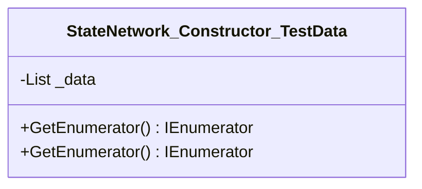

<div id="Engine_Tests-class-diagram"></div>

##### `Engine_Tests` class diagram

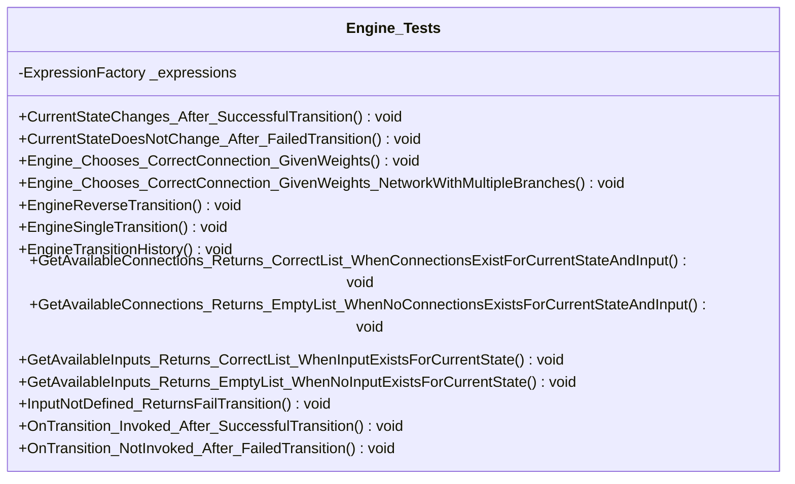

<div id="TransitionHistory_Tests-class-diagram"></div>

##### `TransitionHistory_Tests` class diagram

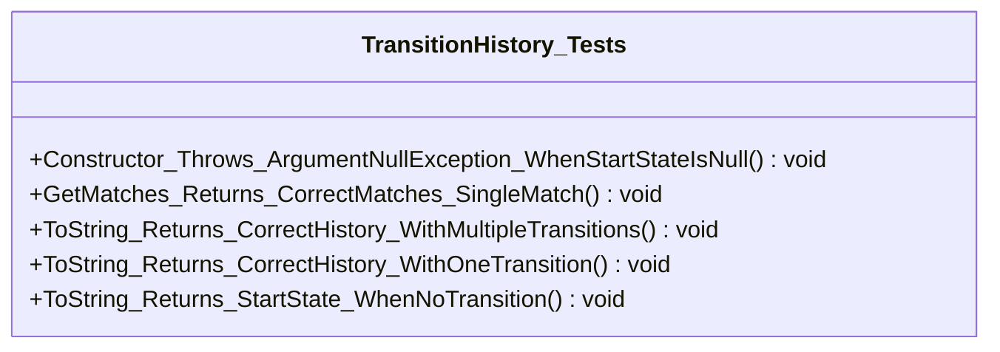

<div id="StateNetwork_Helpers-class-diagram"></div>

##### `StateNetwork_Helpers` class diagram

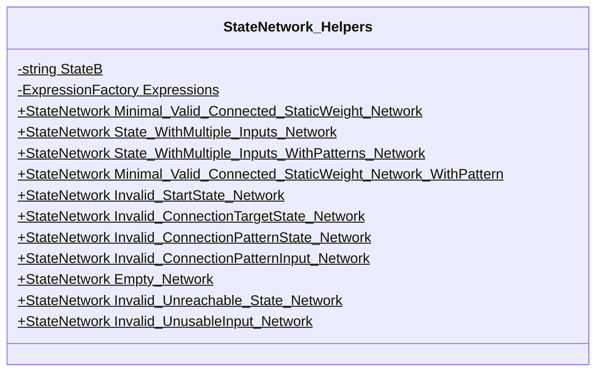

<div id="StateNetworkBuilder_Helpers-class-diagram"></div>

##### `StateNetworkBuilder_Helpers` class diagram

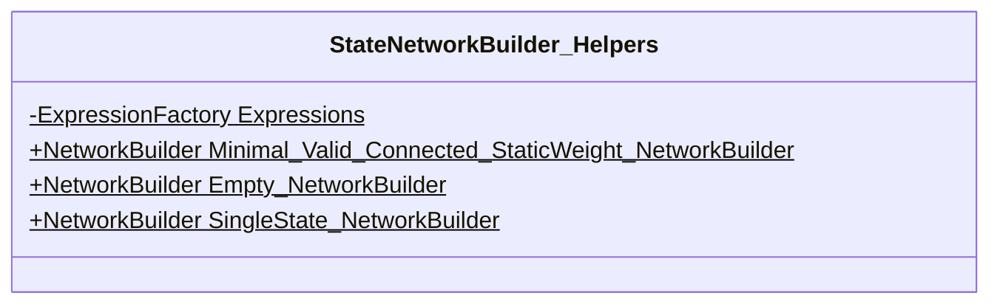

<div id="StateNetworkDictionary_Helpers-class-diagram"></div>

##### `StateNetworkDictionary_Helpers` class diagram

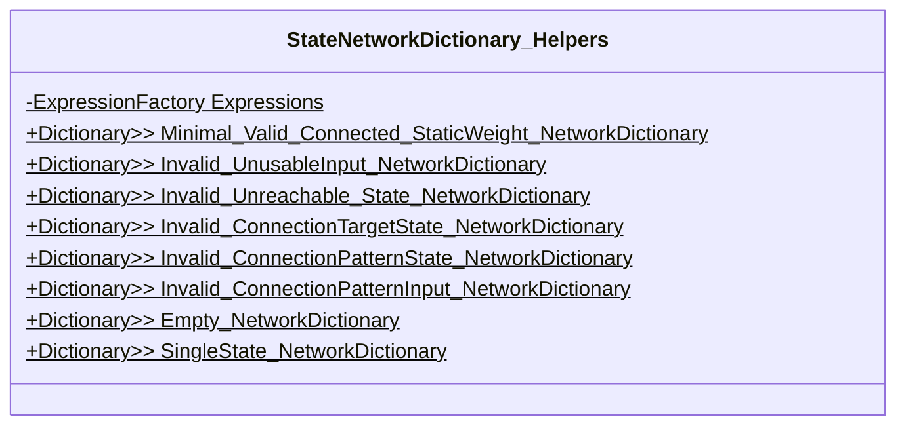

<div id="StateNetwork_Tests-class-diagram"></div>

##### `StateNetwork_Tests` class diagram

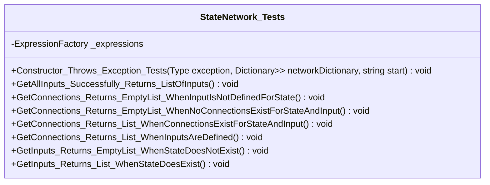

<div id="StateNetworkBuilder_Tests-class-diagram"></div>

##### `StateNetworkBuilder_Tests` class diagram

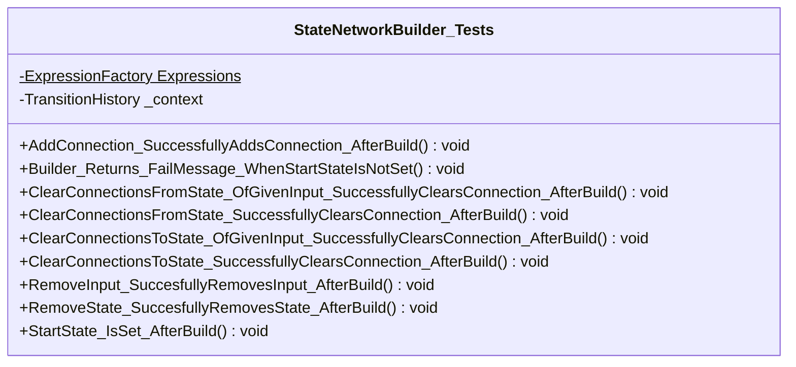

<div id="StateNetworkValidator_TestData-class-diagram"></div>

##### `StateNetworkValidator_TestData` class diagram

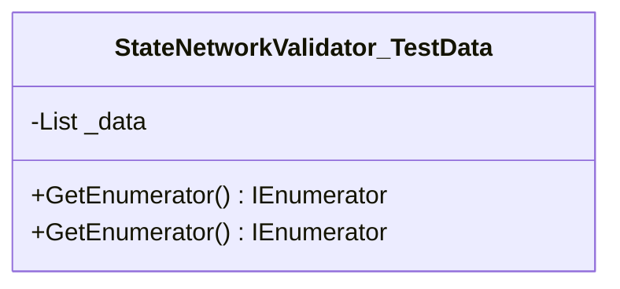

<div id="StateNetworkValidator_Tests-class-diagram"></div>

##### `StateNetworkValidator_Tests` class diagram

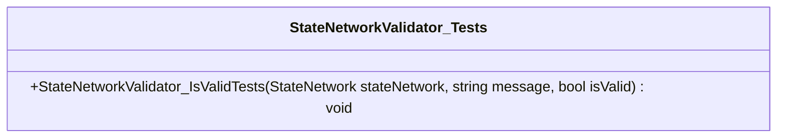

<div id="IsExternalInit-class-diagram"></div>

##### `IsExternalInit` class diagram

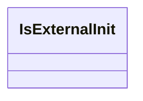

<div id="StateNetEngine-class-diagram"></div>

##### `StateNetEngine` class diagram

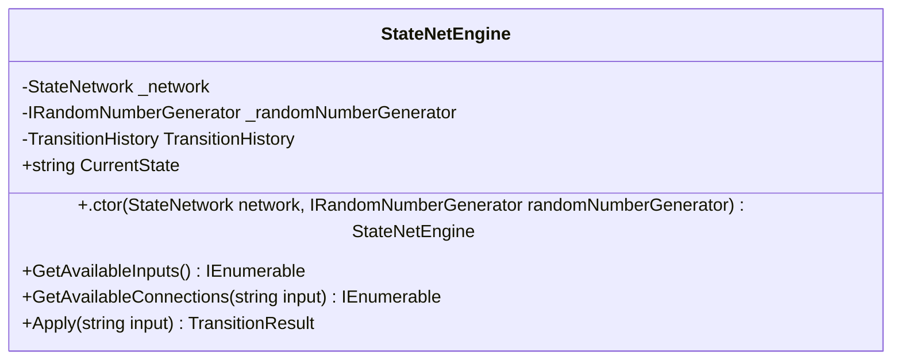

<div id="Matches-class-diagram"></div>

##### `Matches` class diagram

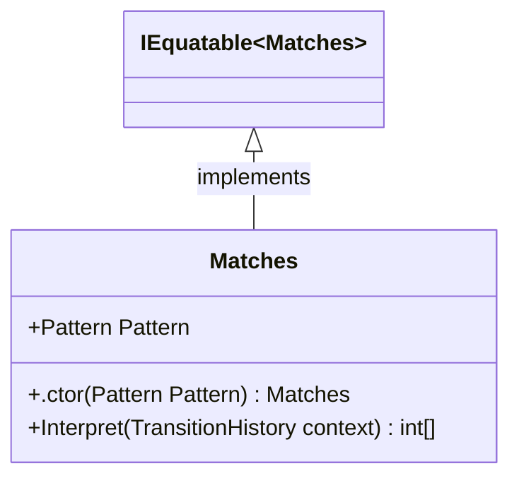

<div id="StateCount-class-diagram"></div>

##### `StateCount` class diagram

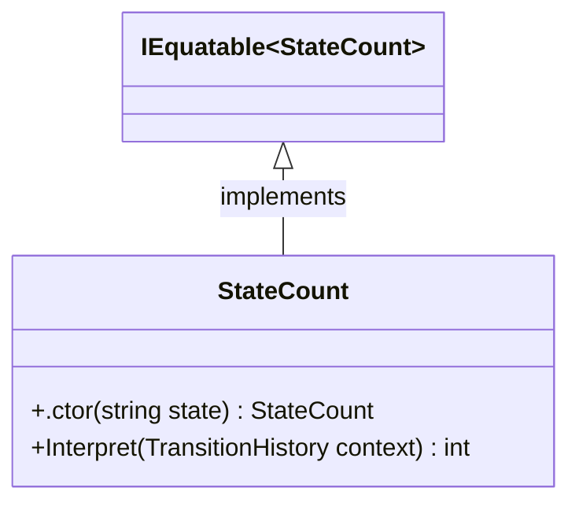

<div id="StateCountFromEnd-class-diagram"></div>

##### `StateCountFromEnd` class diagram

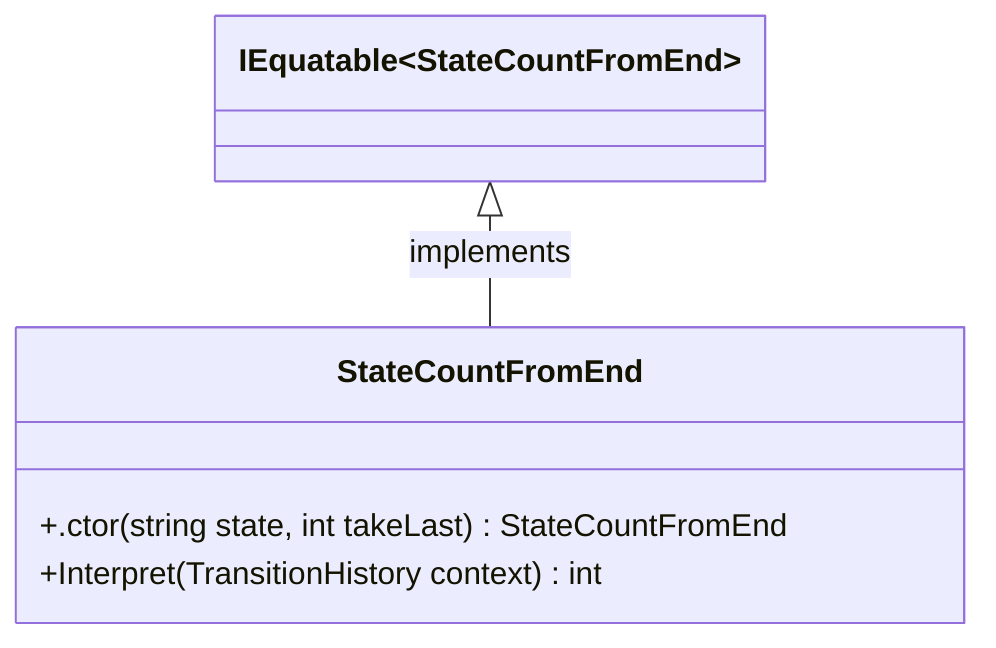

<div id="StateCountStart-class-diagram"></div>

##### `StateCountStart` class diagram

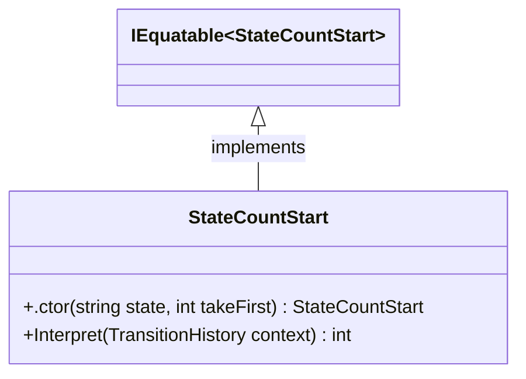

<div id="TransitionCount-class-diagram"></div>

##### `TransitionCount` class diagram

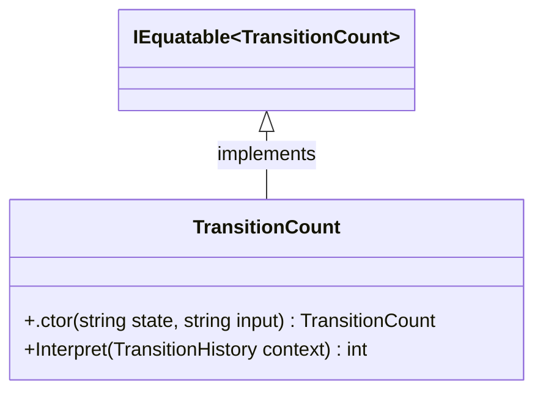

<div id="TransitionCountFromEnd-class-diagram"></div>

##### `TransitionCountFromEnd` class diagram

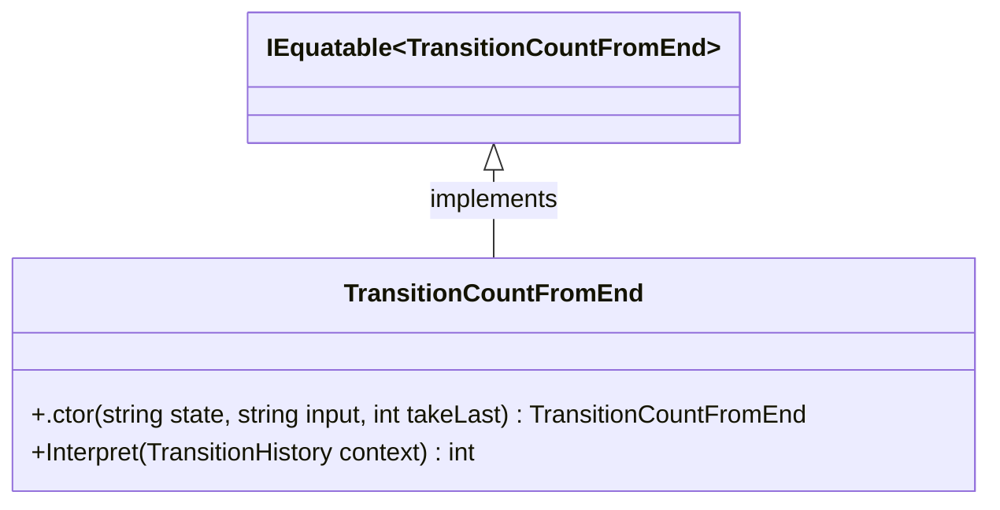

<div id="TransitionCountFromStart-class-diagram"></div>

##### `TransitionCountFromStart` class diagram

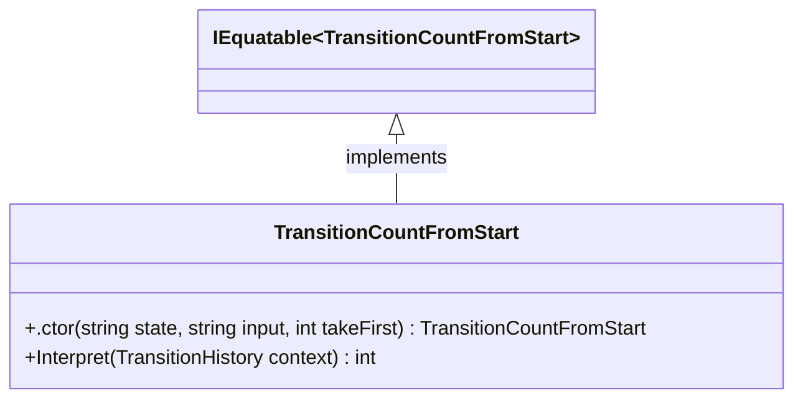

<div id="Connection-class-diagram"></div>

##### `Connection` class diagram

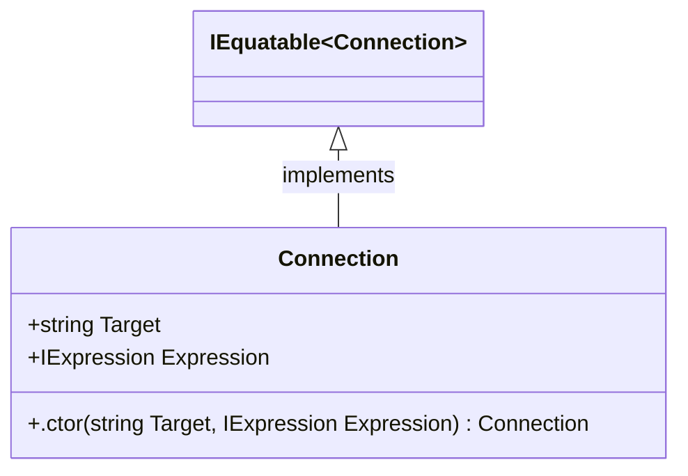

<div id="NetworkBuilder-class-diagram"></div>

##### `NetworkBuilder` class diagram

```mermaid
classDiagram
class NetworkBuilder{
    -List<(string, string, Connection)> _connections
    -HashSet<string> _inputs
    -HashSet<Pattern> _patterns
    -HashSet<string> _states
    -string _startState
    +NetworkBuilder New$
    +.ctor() NetworkBuilder
    +SetStartState(string startState) NetworkBuilder
    +AddState(string state) NetworkBuilder
    +RemoveState(string state) NetworkBuilder
    +AddInput(string input) NetworkBuilder
    +RemoveInputOnState(string input, string state) NetworkBuilder
    +AddConnection(string source, string input, string destination, IExpression<int, TransitionHistory> expression) NetworkBuilder
    +ClearConnectionsFromState(string state, string input) NetworkBuilder
    +ClearConnectionsFromState(string state) NetworkBuilder
    +ClearConnectionsToState(string state, string input) NetworkBuilder
    +ClearConnectionsToState(string state) NetworkBuilder
    +AddPattern(params Pattern[] patterns) NetworkBuilder
    +RemovePattern(params Pattern[] patterns) NetworkBuilder
    +CreateStateNetwork() StateNetworkResult
    +Build() StateNetworkResult
    +Reset() void
}

```

<div id="StateNetwork-class-diagram"></div>

##### `StateNetwork` class diagram

```mermaid
classDiagram
class StateNetwork{
    +Dictionary<string, Dictionary<string, IEnumerable<Connection>>> StateDictionary
    +IEnumerable<Pattern> Patterns
    +string StartState
    +.ctor(string startState, Dictionary<string, Dictionary<string, IEnumerable<Connection>>> stateDictionary, IEnumerable<Pattern> patterns) StateNetwork
    +GetConnections(string state, string input) IEnumerable<Connection>
    +GetConnections(string state) IEnumerable<Connection>
    +GetInputs(string state) IEnumerable<string>
    +GetAllConnections() IEnumerable<Connection>
    +GetAllInputs() IEnumerable<string>
    +GetAllStates() IEnumerable<string>
    +Equals(object obj) bool
    +Equals(StateNetwork other) bool
    +operator ==(StateNetwork lhs, StateNetwork rhs)$ bool
    +operator !=(StateNetwork lhs, StateNetwork rhs)$ bool
}

```

<div id="StateNetworkResult-class-diagram"></div>

##### `StateNetworkResult` class diagram

```mermaid
classDiagram
IEquatable~StateNetworkResult~ <|-- StateNetworkResult : implements
class StateNetworkResult{
    +string Message
    +bool Success
    +StateNetwork? Network
    +.ctor(string Message, bool Success, StateNetwork? Network) StateNetworkResult
    +Fail(string message)$ StateNetworkResult
    +Ok(StateNetwork network, string message)$ StateNetworkResult
}

```

<div id="Pattern-class-diagram"></div>

##### `Pattern` class diagram

```mermaid
classDiagram
class Pattern{
    -Pattern Empty$
    +IEnumerable<string?> Elements
    +IEnumerable<int?> HashedElements
    +int Length
    +.ctor(params string[] elements) Pattern
    +GetHashCode() int
    +Equals(object obj) bool
    +Equals(Pattern other) bool
    +operator ==(Pattern lhs, Pattern rhs)$ bool
    +operator !=(Pattern lhs, Pattern rhs)$ bool
}

```

<div id="PatternMatcher-class-diagram"></div>

##### `PatternMatcher` class diagram

```mermaid
classDiagram
class PatternMatcher{
    -List<int> MatchList
    -Pattern Pattern
    +int PatternIndex
    +.ctor(Pattern pattern) PatternMatcher
    +Add(int index, int hashCode) void
    +IsNextInPattern(int hashCode) bool
}

```

<div id="StringExtensions-class-diagram"></div>

##### `StringExtensions` class diagram

```mermaid
classDiagram
class StringExtensions{
    +GetDeterministicHashCode(string str)$ int
}

```

<div id="IRandomNumberGenerator-class-diagram"></div>

##### `IRandomNumberGenerator` class diagram

```mermaid
classDiagram
class IRandomNumberGenerator{
    +Generate(int min, int max)* int
}

```

<div id="SystemRandomNumberGenerator-class-diagram"></div>

##### `SystemRandomNumberGenerator` class diagram

```mermaid
classDiagram
IRandomNumberGenerator <|-- SystemRandomNumberGenerator : implements
class SystemRandomNumberGenerator{
    -Random RandomGenerator$
    +Generate(int min, int max) int
}

```

<div id="Resources-class-diagram"></div>

##### `Resources` class diagram

```mermaid
classDiagram
class Resources{
    -string UNSET_START_STATE$
    -string INVALID_START_STATE$
    -string INVALID_CONNECTION_TARGET$
    -string INVALID_DEPENDENCY$
    -string UNREACHABLE_STATES$
    -string UNUSABLE_INPUTS$
    -string SUCCESS$
    -string NO_STATES$
    +NO_AVAILABLE_CONNECTION(string currentState, string input)$ string
}

```

<div id="Transition-class-diagram"></div>

##### `Transition` class diagram

```mermaid
classDiagram
IEquatable~Transition~ <|-- Transition : implements
class Transition{
    +string Source
    +string Input
    +string Destination
    +.ctor(string Source, string Input, string Destination) Transition
}

```

<div id="TransitionHistory-class-diagram"></div>

##### `TransitionHistory` class diagram

```mermaid
classDiagram
class TransitionHistory{
    -StateNetwork _network
    -Dictionary<Pattern, PatternMatcher> _patternMatches
    -List<string> _stringTransitionHistory
    -List<int> _transitionHistory
    +int TransitionCount
    +.ctor(StateNetwork network) TransitionHistory
    +CreateMatchTrackers() void
    +GetTransitionHistory() IReadOnlyList<int>
    +GetMatches(Pattern pattern) IEnumerable<int>
    +Add(string input, string destination) void
    +ToString() string
}

```

<div id="TransitionHistoryExtensions-class-diagram"></div>

##### `TransitionHistoryExtensions` class diagram

```mermaid
classDiagram
class TransitionHistoryExtensions{
    +TakeLast<T>(IEnumerable<T> source, int count)$ IEnumerable<T>
}

```

<div id="TransitionResult-class-diagram"></div>

##### `TransitionResult` class diagram

```mermaid
classDiagram
IEquatable~TransitionResult~ <|-- TransitionResult : implements
class TransitionResult{
    +string Message
    +bool Success
    +Transition? Transition
    +.ctor(string Message, bool Success, Transition? Transition) TransitionResult
    +Fail(string message)$ TransitionResult
    +Ok(Transition transition, string message)$ TransitionResult
}

```

<div id="MatchesVisitor-class-diagram"></div>

##### `MatchesVisitor` class diagram

```mermaid
classDiagram
class MatchesVisitor{
    -HashSet<string?> _dependencies
    -HashSet<Pattern> _patterns
    +IReadOnlyList<string?> Dependencies
    +IReadOnlyList<Pattern> Patterns
    +Visit<TType>(TerminalListExpression<TType, TransitionHistory> expression) void
}

```

<div id="StateNetworkExtensions-class-diagram"></div>

##### `StateNetworkExtensions` class diagram

```mermaid
classDiagram
class StateNetworkExtensions{
    +IsValid(StateNetwork network)$ StateNetworkValidationResult
    +GetUsableInputs(StateNetwork network, string state, IEnumerable<string> inputs)$ IEnumerable<string>
    +GetVisitedStatesAndUsableInputs(StateNetwork network, string state, HashSet<string> visitedStates, HashSet<string> usableInputs)$ void
}

```

<div id="StateNetworkValidationResult-class-diagram"></div>

##### `StateNetworkValidationResult` class diagram

```mermaid
classDiagram
class StateNetworkValidationResult{
    +string Message
    +bool Success
    +.ctor(string message, bool success) StateNetworkValidationResult
    +Fail(string message)$ StateNetworkValidationResult
    +Ok(string message)$ StateNetworkValidationResult
}

```

*This file is maintained by a bot.*

<!-- markdownlint-restore -->
